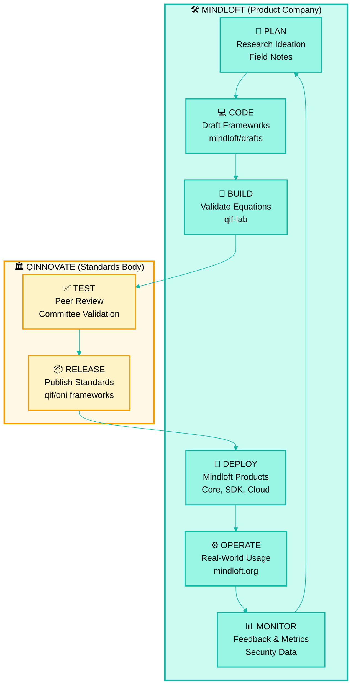

<div align="center">


</div>

# Qinnovate

**Open Standards for Brain-Computer Interface Security**

> *Like NIST for neurosecurity, IEEE for BCIs, W3C for neural interfaces*

Qinnovate is a vendor-neutral standards body developing open frameworks, governance standards, and research for securing brain-computer interfaces.

---

<div align="center">


</div>

## 🏛️ What is Qinnovate?

Qinnovate houses:
- **QIF (Quantum Indeterministic Framework)** — Quantum BCI security model (7-band hourglass)
- **ONI (Open Neurosecurity Interoperability)** — Classical BCI security model (14-layer architecture)
- **Classical↔Quantum Bridge** — Shared threat taxonomy mapping both frameworks
- **Neuroethics Standards** — UNESCO alignment, GDPR/HIPAA compliance, informed consent frameworks
- **Threat Intelligence** — BCI attack taxonomy, threat matrix, security patterns
- **Governance** — Regulatory compliance frameworks, transparency protocols

---

## 📋 Dual-Framework Architecture

### QIF (Quantum Indeterministic Framework)

**Quantum BCI security** - The first framework to incorporate quantum mechanical principles into BCI security.

- **Architecture:** 7-band hourglass model (3-1-3 symmetric: S3/S2/S1/I0/N1/N2/N3)
- **Status:** Active development
- **Version:** 3.1 Hourglass
- **License:** Apache 2.0

[Read the specification →](qif-framework/)

### ONI (Open Neurosecurity Interoperability)

**Classical BCI security** - OSI extension model providing classical security architecture for BCIs.

- **Architecture:** 14-layer model (L1-L14: Silicon → Cognitive Sovereignty)
- **Status:** Active (classical complement to QIF)
- **Version:** 2.x
- **License:** Apache 2.0

[Read the specification →](oni-framework/)

### Classical↔Quantum Bridge

The **shared bridge** maps threats and security controls across both frameworks:

- **Threat matrix** categorized with Κ (common), Δ (differences), Σ (sum)
- **Layer→Band translation** (e.g., L8 → I0, L9 → I0/N1)
- **Validation tools** for consistency checking

[Explore the bridge →](shared/)

---

## ⚖️ Governance & Neuroethics

Qinnovate maintains comprehensive governance standards:

- **UNESCO Alignment** — Neuroethics principles
- **Regulatory Compliance** — GDPR, HIPAA, FDA frameworks
- **Informed Consent** — BCI-specific consent protocols
- **Pediatric Guidelines** — Special protections for minors
- **Accessibility Standards** — Inclusive BCI design
- **Transparency Protocol** — Human-AI collaboration audit trails
- **QIF Neuroethics** — 11 open questions on quantum biometric governance

[View governance standards →](governance/)

---

## 🔬 Research & Publications

Academic papers, technical specifications, and research findings:

### ONI Research
- **31 publications** across 8 topics (coherence metric, neural firewall, quantum encryption, etc.)
- Classical BCI security foundations
- Scale-frequency invariant principles

### QIF Research
- **Quantum indeterminacy** in neural security
- **Decoherence** and quantum threats
- **7-band hourglass** architecture
- Comprehensive whitepaper with equations-as-code

[Browse ONI research →](oni-framework/publications/)
[Browse QIF research →](qif-framework/)

---

## 🌐 Ecosystem

### Implementations

**Mindloft** builds commercial products implementing Qinnovate standards:
- [mindloft.org](https://mindloft.org) — BCI security platform
- Products: Mindloft Core, SDK, Subvocalization BCI
- [github.com/qinnovates/mindloft](https://github.com/qinnovates/mindloft) — Product repository

**Relationship:**
- Qinnovate = Standards body (this repo)
- Mindloft = Product company (implements the standards)

Think: **W3C** (Qinnovate) vs **Chrome** (Mindloft)

### Community

- **Contributing:** Open to academic researchers, security experts, neuroethicists
- **Governance:** Community-driven standards development
- **License:** Apache 2.0 (standards), CC-BY 4.0 (research)

---

## 🔄 Continuous Innovation Cycle

**CI/CD for BCI Security Research & Development**



**The 8-Phase Loop:**

| Phase | Where | What Happens |
|-------|-------|--------------|
| **1. PLAN** | Mindloft | Research ideation, QIF-FIELD-NOTES.md, exploration |
| **2. CODE** | Mindloft | Draft frameworks, QIF-WHITEPAPER.md, equations |
| **3. BUILD** | Mindloft | Validate in qif-lab, update QIF-TRUTH.md |
| **4. TEST** | Qinnovate | Peer review, committee validation, ethics check |
| **5. RELEASE** | Qinnovate | Publish to qif-framework/, oni-framework/, governance/ |
| **6. DEPLOY** | Mindloft | Implement in Mindloft Core, SDK, Cloud products |
| **7. OPERATE** | Mindloft | Real-world deployment at mindloft.org |
| **8. MONITOR** | Mindloft | Gather feedback, metrics, new threats → feeds PLAN |

**Key Separation:**
- **Teal (Mindloft)** = Research, validation, implementation, operations (6 phases)
- **Gold (Qinnovate)** = Standards testing, publication, governance (2 phases)

Standards emerge from real implementations. Products implement validated standards. The cycle never stops.

---

## 🔄 Research Lifecycle (Continuous Innovation Cycle)

```
                    QINNOVATE (Standards Body)
                   ┌──────────────────────────┐
                   │                          │
            ┌──────│  📜 Standards            │
            │      │  Publication             │
            │      │  (QIF/ONI frameworks)    │
            │      └──────────────────────────┘
            │                 │
    8. Public               │ 5. Publish
    Dissemination           │ Standards
            │                 │
            │                 ▼
    ┌───────────────┐   ┌──────────────────────────┐
    │ 🌐 Community  │   │  ⚖️  Governance          │
    │ Collaboration │◀──│  & Ethics Review         │
    │ (Papers,      │   │  (UNESCO, GDPR, FDA)     │
    │  Conferences) │   └──────────────────────────┘
    └───────────────┘                │
            │                        │ 6. Ethics
            │                        │ Alignment
            │                        ▼
            │            ┌──────────────────────────┐
            │            │  🔬 Committee Review     │
            │            │  (Academic, Industry)    │
            │            └──────────────────────────┘
            │                        │
            │                        │ 7. Peer
            │                        │ Validation
            ▼                        ▼
    ┌─────────────────────────────────────────────┐
    │                                             │
    │        MINDLOFT (Product Company)           │
    │                                             │
    │  ┌────────────────────────────────────┐    │
    │  │ 🛠️  Product Implementation        │    │
    │  │ (Mindloft Core, SDK, Cloud)       │    │
    │  └────────────────────────────────────┘    │
    │                   │                         │
    │                   │ 3. Build Products       │
    │                   ▼                         │
    │  ┌────────────────────────────────────┐    │
    │  │ 📊 Real-World Deployment          │    │
    │  │ (User feedback, metrics)          │    │
    │  └────────────────────────────────────┘    │
    │                   │                         │
    └───────────────────┼─────────────────────────┘
                        │
                        │ 4. Gather
                        │ Insights
                        ▼
           ┌──────────────────────────┐
           │  🔍 Research             │
           │  & Exploration           │
           │  (Field notes, QIF-lab)  │
           └──────────────────────────┘
                        │
                        │ 1. Experiment
                        │ & Validate
                        ▼
           ┌──────────────────────────┐
           │  ✅ Validation           │
           │  (QIF-TRUTH.md)          │
           │  Ready for standards     │
           └──────────────────────────┘
                        │
                        │ 2. Canonicalize
                        │
                        └─────────────┐
                                      │
                    (Cycle continues) │
                                      │
                ┌─────────────────────┘
                │
                └──► Back to Standards Publication
```

**The Continuous Loop:**
1. **Research** (Mindloft) → Experiment with new ideas
2. **Validate** (Mindloft) → Test and canonicalize
3. **Build** (Mindloft) → Implement in products
4. **Deploy** (Mindloft) → Gather real-world feedback
5. **Publish** (Qinnovate) → Release as open standards
6. **Govern** (Qinnovate) → Align with ethics and compliance
7. **Review** (Qinnovate) → Academic and industry validation
8. **Disseminate** (Qinnovate) → Share with community

**Key Principle:** Standards evolve from real implementations. Products implement validated standards.

---

## 📂 Repository Structure

```
qinnovates/qinnovate/
├── qif-framework/          # Quantum BCI security (7-band)
│   ├── framework/          # 9 architectural documents
│   ├── qif-lab/            # Equation testing & validation
│   ├── QIF-WHITEPAPER.md   # Comprehensive research
│   └── QIF-TRUTH.md        # Canonical source of truth
│
├── oni-framework/          # Classical BCI security (14-layer)
│   ├── framework/          # Python package + specs
│   ├── publications/       # 31 research papers
│   └── INDEX.md            # Main wiki
│
├── shared/                 # Classical↔Quantum bridge
│   ├── threat-matrix.json  # Κ/Δ/Σ threat taxonomy
│   └── validation/         # Bridge validation tools
│
├── governance/             # Neuroethics & regulatory
│   ├── NEUROETHICS_ALIGNMENT.md
│   ├── TRANSPARENCY.md
│   ├── UNESCO_ALIGNMENT.md
│   └── ... (9 governance documents)
│
└── docs/                   # qinnovate.com website
```

---

## 📚 Resources

| Resource | Description |
|----------|-------------|
| [QIF Whitepaper](https://mindloft.org/qif-whitepaper/) | Interactive whitepaper with AI voiceover |
| [QIF Framework](qif-framework/) | Complete QIF specification |
| [ONI Framework](oni-framework/) | Complete ONI specification |
| [Classical↔Quantum Bridge](shared/) | Threat taxonomy mapping |
| [Governance Docs](governance/) | Neuroethics and compliance standards |
| [Website](https://qinnovate.com) | Official standards body site |

---

## 🤝 Partnerships & Collaboration

Qinnovate seeks partnerships with:
- **Universities** — Academic research collaboration
- **Standards Bodies** — IEEE, NIST, ISO alignment
- **Industry** — Vendor-neutral implementation guidance
- **Regulators** — FDA, EU, regulatory framework development

**Contact:** standards@qinnovate.com

---

## 📄 License

- **Standards & Specifications:** Apache 2.0 License
- **Research Publications:** CC-BY 4.0
- **Governance Documents:** CC-BY 4.0

This ensures open access while allowing commercial implementations.

---

## 🔗 Links

- **Website:** [qinnovate.com](https://qinnovate.com)
- **Product Implementation:** [mindloft.org](https://mindloft.org)
- **GitHub Org:** [github.com/qinnovates](https://github.com/qinnovates)
- **This Repo:** [github.com/qinnovates/qinnovate](https://github.com/qinnovates/qinnovate)

---

<div align="center">

**Defining open standards for the neural frontier**

*Vendor-neutral · Community-driven · Academically rigorous*

</div>

---

*Established: 2026*
*Updated: 2026-02-05*
