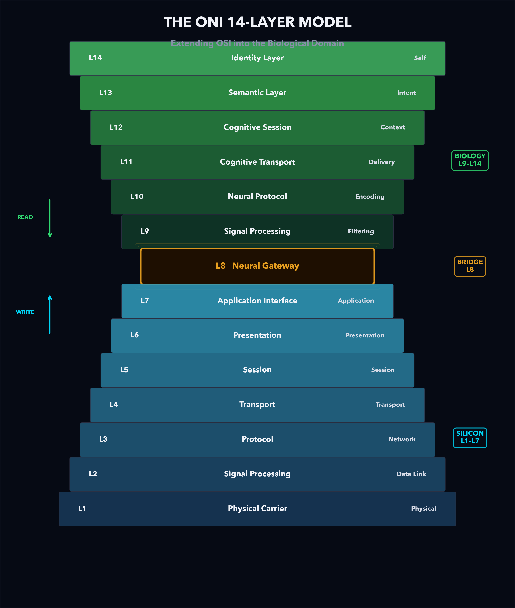

# ONI Framework Whitepaper

## The OSI of Mind: Why Brain-Computer Interfaces Need a Universal Security Standard

**Kevin L. Qi**
qikevinl@github

*Version 1.1 — January 2026*

---

> "Life's most important connections deserve the most thought."

---

## Table of Contents

1. [Introduction](#1-introduction)
2. [Why BCIs Need Their Own Security Standard](#2-why-bcis-need-their-own-security-standard)
3. [The Cost of Inaction](#3-the-cost-of-inaction)
4. [The ONI Framework: A 14-Layer Model](#4-the-oni-framework-a-14-layer-model)
5. [Design Principles](#5-design-principles)
6. [The Coherence Metric](#6-the-coherence-metric)
7. [The Scale-Frequency Invariant](#7-the-scale-frequency-invariant)
8. [The Neural Firewall](#8-the-neural-firewall)
9. [TARA: From Framework to Implementation](#9-tara-from-framework-to-implementation)
10. [Regulatory Alignment](#10-regulatory-alignment)
11. [Quantum-Ready Security](#11-quantum-ready-security)
12. [Conclusion](#12-conclusion)
    - [12.4 Toward Formal Standardization](#124-toward-formal-standardization)
13. [References](#13-references)

---

## 1. Introduction

In 1983, the International Organization for Standardization published the OSI model — seven layers that gave engineers a common language for building, securing, and reasoning about digital networks. Every firewall, every VPN, every encrypted connection you use today traces its lineage to that abstraction.

Forty years later, networks have reached a new endpoint: the human brain.

Neuralink has implanted its N1 chip in human patients. Synchron's Stentrode is in clinical trials. Blackrock Neurotech's Utah arrays have been recording neural signals for over a decade. The FDA classifies brain-computer interfaces as Class III medical devices, and multiple companies have received Breakthrough Device Designation for clinical trials. The technology is no longer theoretical — it's surgical.

**But there is no OSI model for the brain.**

No standardized framework tells engineers which layer an attack targets, which signals to trust, or how to validate that a stimulation command is safe. No common vocabulary bridges the neuroscientist studying oscillatory synchronization and the security engineer building intrusion detection systems. Every company — Neuralink, Synchron, Blackrock, Paradromics — is building its own proprietary stack, its own signal protocols, its own safety logic. There is no shared language, no interoperability, no way to compare one device's security posture against another's.

This is not a new problem. Before IEEE 802, every computer network was an island. Before TCP/IP, machines from different manufacturers couldn't talk to each other. The internet didn't become the internet until committees of engineers agreed on common standards. **The BCI industry today is where networking was in the 1970s — powerful technology, zero standardization.**

The ONI Framework — **Open Neurosecurity Interoperability** — exists to change that.

> *"Only life's most important connections deserve the most thought."*

This whitepaper presents the ONI Framework: a 14-layer reference architecture that extends OSI into biological territory, providing the security industry with a structured, mathematically grounded, and regulation-ready model for protecting the bio-digital boundary.

> **A note on terminology:** Foundational research in this space — Kohno (2009), Bonaci (2015), and others — established the term *"BCI security."* This whitepaper honors that terminology when citing their work. For its own framing, ONI adopts **neurosecurity** as the broader discipline name. "BCI security" is anchored to today's hardware — electrodes, implants, computers. But the threats modeled in ONI's upper layers (cognitive manipulation at L12, semantic interference at L13, identity fragmentation at L14) are not limited to computer interfaces. Future neural interfaces may be biological, chemical, optical, or technologies not yet conceived. *Neurosecurity* protects the neural system itself, regardless of what interfaces with it.

---

## 2. Why BCIs Need Their Own Security Standard

### 2.1 The Scale of the Opportunity

The BCI market is projected to reach **$6.2 billion by 2030** (Grand View Research, 2023), with applications spanning:

| Application | Current Stage | Market Size (est.) |
|-------------|---------------|-------------------|
| Motor restoration (paralysis) | FDA-approved | $1.2B |
| Epilepsy management | FDA-approved | $800M |
| Depression treatment (DBS) | FDA-approved | $600M |
| Cognitive enhancement | Clinical trials | $2.0B |
| Neural communication | Research | $1.6B |

These are not consumer gadgets. They are medical devices implanted inside human skulls, connected wirelessly to phones and cloud services, capable of both reading thoughts and writing signals directly to neural tissue.


*Figure 1. Global BCI market projection showing ~15.5% CAGR from $1.8B (2022) to $6.2B (2030). Source: Grand View Research, 2023.*

### 2.2 The Scale of the Threat

Every BCI deployed today is a bidirectional neural interface — it can read *and* write:

```
READ PATH:  Neural Tissue → Electrodes → Amplification → Digitization → Wireless TX → Cloud
WRITE PATH: Cloud → Wireless RX → Validation → Electrical Stimulation → Neural Tissue
```

This bidirectionality creates attack vectors that have no precedent in cybersecurity:

| Attack Type | Impact | Precedent |
|-------------|--------|-----------|
| Neural eavesdropping | Private thought extraction | Wiretapping (digital equivalent) |
| Stimulation injection | Involuntary movement, pain, seizure | Stuxnet (physical damage via cyber) |
| Neural ransomware | Device lockout until payment | Hospital ransomware ($20B/yr) |
| Identity manipulation | Gradual personality alteration | No precedent — entirely new |
| Emotional hijacking | Forced fear, pleasure, or apathy | No precedent — entirely new |

### 2.3 Why Existing Frameworks Are Insufficient

| Framework | What It Covers | What It Misses |
|-----------|---------------|----------------|
| OSI Model | Digital network layers (L1-L7) | Biological tissue, neural signals, cognition |
| MITRE ATT&CK | IT/OT attack techniques | Neural attack vectors, bio-digital boundary |
| NIST CSF | Cybersecurity risk management | Neural-specific threats, coherence validation |
| IEC 62443 | Industrial control systems | Brain-specific signal integrity, cognitive layers |
| HIPAA | Health data privacy | Real-time neural data, stimulation safety |

**The gap is clear:** existing frameworks treat the brain as just another endpoint. It isn't. The brain is living tissue that cannot be patched, rebooted, or replaced. A compromised neural interface doesn't lose data — it loses function, autonomy, or identity.


*Figure 2. BCI requirements dramatically exceed 5G NR across every dimension — latency, reliability, power constraint, error consequence, security overhead, and feedback latency. BCIs operate under constraints no existing standard was designed for.*

### 2.4 The Standardization Bottleneck

The biggest bottleneck in BCI today is not just security — it is **standardization**.

Every BCI company builds its own proprietary signal processing pipeline, its own safety validation, its own data formats. Neuralink's N1 chip speaks a different protocol than Synchron's Stentrode, which is incompatible with Blackrock's Utah array. A security researcher who finds a vulnerability in one system has no framework to describe whether the same class of vulnerability exists in others. A regulator evaluating one device has no common baseline to compare it against.

This is exactly where computer networking was before standardization:

| Era | Before Standard | After Standard | What Changed |
|-----|----------------|---------------|--------------|
| **Networking (1970s)** | Every manufacturer had proprietary protocols (IBM SNA, DECnet, AppleTalk) | OSI model (1983), TCP/IP suite | Engineers could reason about *layers*, not *vendors*. Any device could talk to any other. |
| **Wireless (1990s)** | Proprietary wireless protocols, no interoperability | IEEE 802.11 (Wi-Fi), Bluetooth SIG | A single standard enabled an entire ecosystem. |
| **Web (1990s)** | Competing document formats, browser wars | W3C standards (HTML, HTTP, CSS) | The open web became possible because everyone agreed on the format. |
| **BCIs (today)** | **Every company builds its own stack** | **?** | **This is the problem ONI is designed to solve.** |

The pattern is consistent: **transformative technology only scales when the industry agrees on a shared abstraction.** The OSI model didn't tell Cisco how to build a router — it told every engineer what a router *does*, which layer it operates at, and how to reason about its security. That shared vocabulary is what enabled the internet security industry to exist.

ONI provides that same shared vocabulary for the brain. It doesn't prescribe implementation — it defines the layers, the boundaries, the metrics, and the threat surfaces. Any company can build to the ONI model, just as any manufacturer can build to TCP/IP.

But ONI has an advantage that OSI never had: **hindsight.**

The OSI model was invented in 1983 — before the first major computer virus (Brain, 1986), before the Morris worm (1988), before ransomware, before zero-day markets, before nation-state cyber operations. Security was never part of the original design. It was bolted on after the fact, layer by painful layer — SSL in 1995, IPsec in 1998, WPA2 in 2004, TLS 1.3 in 2018 — each one addressing a security gap that the original model never accounted for. The internet was built open and trusting, and the security community has spent four decades trying to retrofit protections onto a foundation that was never designed for them.

We don't have to repeat that mistake. The cybersecurity industry has accumulated decades of hard-won knowledge: zero-trust architecture, defense-in-depth, secure-by-design principles, threat modeling methodologies, incident response frameworks, and the painful economics of "bolt-on" vs. "built-in" security. ONI incorporates all of this from day one. The Coherence Metric, the Neural Firewall, the layer-aware threat model — these aren't afterthoughts. They are foundational. Every layer of the ONI Framework was designed with security as a first-class constraint, not a feature to be added later.

**This is the unique opportunity of neurosecurity: we get to do it right the first time.** The BCI industry is early enough that the standard hasn't been set yet, and the security community is mature enough to know exactly what "right" looks like. ONI exists at the intersection of those two facts.

**The ultimate goal of the ONI Framework is not to be a product — it is to be the standard that makes an entire industry of neural security products possible.** ONI is designed as a proposal — a seed specification that could be submitted to formal standards bodies like IEEE and ISO/IEC, or serve as the foundation for a dedicated neurotech standards organization. The path from open research to ratified standard is long, but every successful standard started as someone's proposal.

---

## 3. The Cost of Inaction

### 3.1 What Happens Without a Standard

History teaches a consistent lesson: security standards adopted *after* exploitation cost orders of magnitude more than proactive frameworks.

| Domain | Pre-Standard Cost | Post-Standard Cost | Catalyst for Standard |
|--------|------------------|--------------------|----------------------|
| Internet (pre-TLS) | $0 (no encryption) | $4.45M avg breach (IBM, 2023) | E-commerce fraud epidemic |
| Medical devices (pre-FDA guidance) | Minimal security spend | $10M+ per recall | Pacemaker vulnerability demos (2012–2017) |
| Industrial control (pre-IEC 62443) | $0 (air-gapped assumption) | $4.4M ransom + massive economic disruption (Colonial Pipeline, 2021) | Critical infrastructure attacks |
| **BCIs (today)** | **Minimal — no standard exists** | **Unknown — but the stakes are human** | **?** |

The pattern is clear: every connected system eventually gets attacked. The question isn't whether neural interfaces will be targeted, but whether defenses will be in place when they are.

### 3.2 The Unique Economics of Neural Security

Unlike data breaches, neural security failures create costs that compound over a patient's lifetime:

| Cost Category | Traditional Breach | Neural Breach |
|---------------|-------------------|---------------|
| Immediate damage | Data exposed | Physical/cognitive harm |
| Remediation | Patch software, reset credentials | Surgical intervention ($200K+) |
| Recovery time | Days to weeks | Months to never (neural adaptation) |
| Legal liability | Per-record fines ($150-$450/record) | Personal injury litigation (millions) |
| Reputational | Brand damage | Industry-wide setback |
| Regulatory | Fines, audits | Potential moratorium on BCI technology |

**A single high-profile neural attack could set the entire BCI industry back by a decade.**


*Figure 3. Historical pattern: security standards adopted after exploitation cost orders of magnitude more. The Internet, medical devices, and industrial control all followed this pattern. BCIs are at the inflection point today.*

The ONI Framework exists to prevent that outcome.

---

## 4. The ONI Framework: A 14-Layer Model

### 4.1 The Core Insight

The OSI model works because it provides *layer isolation*: each layer has a defined function, communicates through well-specified interfaces, and can be secured independently.

The ONI Framework applies the same principle to the bio-digital boundary:

- **L1–L7 (Silicon Domain):** Traditional OSI — data movement, routing, encryption
- **L8 (Neural Gateway):** The critical boundary — the firewall between silicon and biology
- **L9–L14 (Biology Domain):** Neural processing, cognition, identity

### 4.2 The 14-Layer Stack



*Figure 4. The ONI 14-Layer Model. L1-L7 (Silicon, blue) map to traditional OSI networking. L8 (Neural Gateway, amber) is the critical firewall boundary. L9-L14 (Biology, green) extend into neural processing, cognition, and identity. The hourglass shape reflects the narrowing at L8 — the chokepoint where all signals must be validated.*

### 4.3 Why 14 Layers?

Each layer isn't arbitrary — it maps to a distinct physical process with its own frequency range, spatial scale, and security considerations:

| Layer | Frequency Range | Spatial Scale | What It Protects |
|-------|----------------|---------------|------------------|
| L1-L7 | Hz → THz | nm → global | Data in transit |
| L8 | 1–500 Hz | μm–mm | The bio-digital boundary |
| L9 | 1–500 Hz | Embedded systems | Signal integrity |
| L10 | Event-driven | Device ↔ compute | Neural data format |
| L11 | Seconds → minutes | Distributed systems | Cognitive state reliability |
| L12 | Seconds → minutes | Cortical networks | Context and attention |
| L13 | Minutes → hours | Association cortex | Meaning and intent |
| L14 | Days → lifetime | Whole brain | Identity and autonomy |

### 4.4 L8: The Most Important Layer

L8 — the Neural Gateway — is where the ONI Firewall operates. Every signal crossing between silicon and biology must pass through this chokepoint.


*Figure 5. Threat severity by layer, showing L8 (Neural Gateway) as the most critical attack surface — highlighted in amber. Identity attacks peak at L14, while signal injection concentrates at L8-L9. This visualization demonstrates why multi-layer security monitoring is essential.*

**Key principle:** No neural data crosses without policy, trust, and security validation. This is not a metaphor — it's an enforcement point.

> **Deep dive:** See the full 14-layer specification in [TechDoc-ONI_Framework.md](TechDoc-ONI_Framework.md) and the accessible overview in [Blog-ONI_Framework.md](Blog-ONI_Framework.md).

---

## 5. Design Principles

The ONI Framework is built on five foundational principles:

### 5.1 Layered Abstraction

Each layer operates at characteristic frequencies, spatial scales, and energy profiles. A security engineer can reason about L8 without understanding L14, just as a network engineer can work on L3 without understanding L7.

### 5.2 Scale Invariance

As we ascend the stack, frequency decreases while spatial scale and semantic compression increase. This isn't coincidence — it reflects physical constraints that we formalize as the Scale-Frequency Invariant (Section 7).

### 5.3 Structure Preservation

Coherence — not mere signal transmission — is the fundamental invariant. A signal can arrive with full power but zero coherence. The Coherence Metric (Section 6) quantifies this.

### 5.4 Security by Design

Each layer boundary is a potential attack surface. The framework identifies threats at every layer, not just the network perimeter.

### 5.5 Species Agnosticism

The framework applies to any neural system — from rodent models to primate studies to human clinical applications. The same 14-layer structure works across species; only the parameter values change.

---

## 6. The Coherence Metric

### 6.1 The Core Question

How do you know a neural signal is trustworthy?

Traditional cybersecurity authenticates the *source* of a message. But in the neural domain, source authentication alone is insufficient. A signal might come from a legitimate device yet carry corrupted content. The brain has no dedicated mechanism for tagging signals as endogenous vs. exogenous at the level of individual spikes or oscillatory cycles — if a signal's amplitude, frequency, and timing fall within biological norms, downstream circuits will process it as real.

We need a metric that examines the *signal itself*.

### 6.2 The Formula

**Cₛ = e^(−(σ²ᵩ + σ²τ + σ²ᵧ))**

Three dimensions. One score. Trustworthiness.

| Component | What It Measures | Biological Basis |
|-----------|-----------------|------------------|
| σ²ᵩ (Phase variance) | Timing jitter relative to brain rhythms | Spike-timing dependent plasticity requires ±5-20 ms precision |
| σ²τ (Transport variance) | Pathway reliability | Synaptic transmission varies from 10% to 99.9% reliability |
| σ²ᵧ (Gain variance) | Amplitude stability | Neurons maintain gain through homeostatic mechanisms |

### 6.3 How It Works

```
Cₛ = 1.0   → Perfect coherence (zero variance — full signal trust)
Cₛ = 0.37  → Moderate uncertainty (total variance = 1)
Cₛ → 0     → Signal untrusted — variance too high

Threshold for acceptance: Cₛ > 0.6 (with valid authentication)
```

The exponential form was chosen deliberately: it models biological threshold behavior. Neural systems exhibit sharp transitions — a signal either exceeds the threshold for downstream propagation or it doesn't.

### 6.4 Design Motivation

The exponential form Cₛ = e^(−(σ²φ + σ²τ + σ²γ)) is a **design choice**, not a derivation from information theory. Its motivation is threefold:

1. **Gaussian likelihood interpretation:** If Fourier component deviations are normally distributed with zero mean, then e^(−σ²) is proportional to the probability of observing zero deviation. Total coherence is the joint probability across all three dimensions (phase, transport, gain), assuming independence.

2. **Sharp threshold behavior:** The exponential creates rapid decay — Cₛ ≈ 1 when total variance is low, but collapses rapidly past a critical variance. This models biological all-or-nothing gating.

3. **Bounded range:** Cₛ ∈ (0, 1], with Cₛ = 1 when all variances are zero (perfect coherence) and Cₛ → 0 as variance increases.

> **Note:** The exponent is a sum of variances, not Shannon entropy. Variance (σ² = E[(X − μ)²]) and entropy (H = −Σ p(x) log p(x)) are distinct mathematical quantities. For Gaussian distributions, entropy H = ½ ln(2πeσ²) — a logarithmic function of variance, not a linear sum. See the [Mathematical Audit, Finding 3](../mathematical-foundations/TechDoc-Mathematical_Audit.md) for the full analysis.

### 6.5 Comparison to Existing Systems

| Parameter | 5G NR | BCI Requirement |
|-----------|-------|-----------------|
| Latency | 1–10 ms | <1 ms (closed-loop motor) |
| Reliability | 99.999% | 99.9999%+ (safety-critical) |
| Power budget | 1–10 W | <25 mW (total implant) |
| Error consequence | Dropped packet | Potential tissue damage |

The critical difference: in wireless, a dropped packet triggers retransmission. In neural interfaces, a corrupted stimulation signal could cause seizure, involuntary movement, or permanent tissue damage.


*Figure 6. Left: The Coherence Metric exponential decay curve. Signals above Cₛ > 0.6 are accepted; between 0.3–0.6 are flagged; below 0.3 are rejected. Right: Variance component breakdown across signal types — from healthy signals (Cₛ = 0.96) to random noise (Cₛ = 0.05). The three components (phase, transport, gain) decompose signal quality into independently measurable dimensions.*

> **Deep dive:** See the complete mathematical derivation and Fourier decomposition in [TechDoc-Coherence_Metric_Detailed.md](../coherence-metric/TechDoc-Coherence_Metric_Detailed.md).

---

## 7. The Scale-Frequency Invariant

### 7.1 The Discovery

Across every level of neural processing, a striking pattern emerges:

**f × S ≈ k**

Where:
- **f** = characteristic frequency (Hz)
- **S** = spatial scale (meters)
- **k** = constant (~1-100 m·Hz for mammalian neural systems)

This holds across orders of magnitude in both frequency and spatial scale.

### 7.2 The Evidence

| Processing Level | Frequency | Spatial Scale | f × S (m·Hz) |
|------------------|-----------|---------------|---------------|
| Ion channel dynamics | 1000 Hz | 10 nm | 10⁻⁵ |
| Action potential | 500 Hz | 1 μm | 5 × 10⁻⁴ |
| Gamma oscillation | 40 Hz | 2.5 cm | 1 |
| Alpha rhythm | 10 Hz | 10 cm | 1 |
| Theta rhythm (working memory) | 6 Hz | 8 cm | 0.48 |

The product f × S clusters within a narrower range than either variable alone — spanning roughly 5 orders of magnitude despite frequency spanning 4+ orders and spatial scale spanning 7+ orders.

### 7.3 Why This Matters for Security

The invariant has a direct practical consequence: **security monitoring must operate at multiple timescales simultaneously.**

| Monitoring Layer | Timescale | What It Detects |
|-----------------|-----------|-----------------|
| L8-L9 | Milliseconds | Malicious stimulation, amplitude violations |
| L10 | Tens of ms | Phase-locking anomalies, rhythm disruption |
| L11-L12 | Seconds to minutes | Cognitive state manipulation, attention hijacking |
| L13-L14 | Hours to days | Gradual personality modification, identity drift |

A firewall that only monitors at one timescale will miss attacks at other timescales.


*Figure 7. The Scale-Frequency Invariant on a log-log plot. Each data point represents a distinct neural processing level, from ion channels (top-left) to theta-band working memory networks (bottom-right). Despite spanning multiple orders of magnitude in both frequency and spatial scale, all points fall within a band consistent with f × S ≈ k. The dashed lines show constant f×S products. This invariant emerges from the physics of axonal conduction.*

### 7.4 Physical Derivation

The invariant isn't arbitrary — it emerges from physics. For a neural network of spatial extent S to maintain coherent oscillation at frequency f, signals must complete a round-trip within one period:

**2S/v ≤ 1/f** → **f × S ≤ v/2**

For myelinated axons (v ≈ 50 m/s), this gives f × S ≤ 25 m·Hz — consistent with observed values. Evolution has optimized neural systems to operate near this physical boundary.

> **Dispersion caveat:** This derivation assumes constant signal velocity. In practice, neural tissue is **dispersive** — its dielectric properties are frequency-dependent, following the Cole-Cole model (Cole & Cole, 1941; Gabriel et al., 1996). This means v(f) varies with frequency, and the product f × S is not strictly constant. The qualitative scaling — higher frequencies at smaller spatial scales — is well-supported by neuroscience (Buzsáki & Draguhn, 2004), but quantitative use requires dispersion-corrected velocity. Defining layer-specific k(f) ranges is identified as open research.

> **Deep dive:** See the full empirical analysis and physical derivation in [TechDoc-Scale_Frequency.md](../scale-frequency/TechDoc-Scale_Frequency.md) and the [Mathematical Audit, Finding 4](../mathematical-foundations/TechDoc-Mathematical_Audit.md).

---

## 8. The Unified Layer-Aware Coherence Metric

Sections 6 and 7 established two independent results: the Coherence Metric (Cₛ) measures signal trustworthiness, and the Scale-Frequency Invariant (f × S ≈ k) constrains which frequencies belong at which spatial scales. These operate on the same Fourier-decomposed signal but are computed separately. This section unifies them into a single, physically-grounded metric.

### 8.1 The Problem with Separate Checks

The base coherence metric Cₛ = e^(−(σ²φ + σ²τ + σ²γ)) treats all frequency components equally. A signal at 40 Hz receives the same scrutiny whether it arrives at L1 (electrode array, ~mm scale) or L13 (whole-brain semantic processing, ~20 cm scale). But physics tells us 40 Hz gamma oscillations operate at cortical-column scale (~1 mm) — they have no business appearing as a dominant component in whole-brain processing. The base metric would miss this.

### 8.2 The Unified Formulation

**Cₛ(S) = e^(−Σ_f w(f, S) · (σ²φ(f) + σ²τ(f) + σ²γ(f)))**

Where:
- **S** = spatial scale of the evaluation layer (meters)
- **f** = frequency component (from Short-Time Fourier Transform)
- **w(f, S)** = weighting function derived from f × S ≈ k
- **σ²φ(f), σ²τ(f), σ²γ(f)** = per-frequency variance for phase, transport, and gain

The weighting function penalizes frequency components that are physically inappropriate for the layer's spatial scale. A signal with the wrong frequency profile for its target layer will produce a lower Cₛ(S) — even if its phase, amplitude, and timing look individually normal.

### 8.3 Physical Foundations

The unified metric is grounded in a chain of established physics, each equation governing a different aspect of how signals originate, propagate, and are measured in neural tissue:

| Equation | Formula | What It Governs | ONI Application |
|----------|---------|-----------------|-----------------|
| **Maxwell (quasi-static)** | ∇·(σ∇V) = Iₛ | Electric field propagation through tissue; at BCI frequencies (<10 kHz), displacement current is negligible — fields are quasi-static, not propagating waves | L1 signal physics, volume conduction model, why wavefront visualization is pedagogical (not literal) |
| **Boltzmann distribution** | P ∝ e^(−E/kT) | Probability of a state at energy E; governs ion channel gating, thermal noise floor, and statistical mechanics of neural populations | Cₛ metric form — e^(−σ²) has the mathematical form of a Boltzmann factor, where variance plays an analogous role to energy |
| **Nernst equation** | E = (RT/zF) ln([ion]out/[ion]in) | Equilibrium potential for each ion species across the neural membrane; derives from Maxwell + Boltzmann | Resting potential (−70 mV), action potential thresholds — the voltage baselines that BCI signals must respect |
| **Nernst-Planck** | J = −D∇c − (zF/RT)Dc∇V | Ion flux under both concentration gradient and electric field; combines diffusion with electrostatic drift | Ion transport across membranes — the actual current carriers in neural tissue (Na⁺, K⁺, Ca²⁺, Cl⁻) |
| **Einstein diffusion** | D = kT/(6πηr) | Diffusion coefficient for particles in fluid; governs neurotransmitter transport across the ~20-40 nm synaptic cleft | L9-L10 biology layers — chemical signaling speed and reliability at synapses |
| **Hodgkin-Huxley** | C_m(dV/dt) = −Σ gᵢmᵖhᵍ(V − Eᵢ) + I_ext | Action potential dynamics; uses Boltzmann gating variables (m, h, n) with Nernst reversal potentials | Signal generation model — what authentic neural signals look like, providing the baseline for coherence scoring |
| **Cole-Cole model** | ε*(ω) = ε_∞ + Σ Δεᵢ/(1+(jωτᵢ)^(1−αᵢ)) | Frequency-dependent dielectric properties of tissue; four dispersions (α, β, δ, γ) across the spectrum | Dispersion correction for f × S ≈ k; determines v(f) and therefore the weighting function w(f, S) |
| **Fourier Transform** | X(f) = ∫ x(t)e^(−i2πft) dt | Decomposes any signal into frequency components, each with amplitude, frequency, and phase | Core analysis tool — breaks incoming signals into the components that Cₛ(S) evaluates |

**The chain:** Maxwell governs how fields exist in tissue → Boltzmann governs ion statistics and channel gating → Nernst-Planck describes ion transport → Einstein diffusion describes neurotransmitter transport → Hodgkin-Huxley models the resulting action potentials → Cole-Cole characterizes tissue's frequency response → Fourier decomposes the measured signal → **Cₛ(S) scores it**, using a Boltzmann-factor form weighted by the scale-frequency relationship.

### 8.4 The Weighting Function

The weighting function w(f, S) encodes the scale-frequency invariant into the coherence calculation. For a layer at spatial scale S, the expected characteristic frequency is f_expected ≈ k/S. Components far from this frequency should be penalized:

**w(f, S) = 1 + α · e^(−(f − k/S)² / 2δ²)**

Where:
- **k/S** = expected frequency for spatial scale S
- **α** = penalty amplitude (how much extra weight off-frequency components receive)
- **δ** = bandwidth parameter (how sharply the penalty falls off)

When f ≈ k/S (frequency matches the layer's spatial scale), w ≈ 1 + α — the component receives heightened scrutiny because it *should* be present and any deviation matters. When f is far from k/S, w ≈ 1 — standard coherence checking applies, but the component is less relevant to this layer's function.

> **Note on form:** This is one of several valid weighting functions. A hard bandpass, a sigmoid, or an empirically-derived profile from EEG recordings could serve the same role. The Gaussian form was chosen because it keeps the full metric as a product of exponentials — mathematically clean and computationally efficient.

### 8.5 Per-Layer Spatial Scales

| ONI Layer | Function | Spatial Scale (S) | Expected Frequency Band | Basis |
|-----------|----------|-------------------|------------------------|-------|
| L1 | Physical Carrier | ~10 μm (electrode pitch) | >1 kHz | Electrode geometry |
| L2 | Signal Processing | ~1 mm (chip area) | 100 Hz – 10 kHz | ADC/filter bandwidth |
| L8 | Neural Gateway | ~1-5 mm (electrode-tissue interface) | 1 Hz – 1 kHz | Interface geometry |
| L9 | Bio Signal Processing | ~100 μm (cortical column width) | 30-100 Hz (gamma) | Cortical microcolumn |
| L10 | Neural Protocol | ~1 cm (cortical area) | 8-30 Hz (alpha/beta) | Local cortical circuit |
| L11 | Cognitive Transport | ~5 cm (lobe region) | 4-8 Hz (theta) | Inter-regional pathway |
| L12 | Cognitive Session | ~10 cm (inter-lobe) | 1-4 Hz (delta) | Cross-hemispheric |
| L13 | Semantic Layer | ~15 cm (distributed network) | 0.1-1 Hz (infra-slow) | Large-scale integration |
| L14 | Identity & Ethics | ~20 cm (whole brain) | <0.1 Hz (ultra-slow) | Global state |

> **Note:** L3-L7 (Protocol through Application) are digital processing layers where signal analysis is discrete, not continuous. The layer-aware coherence metric applies to layers where signals are analog or quasi-analog: L1-L2 (silicon-side), L8 (gateway), and L9-L14 (biology-side). Digital layers use conventional security checks (checksums, authentication, protocol validation).

### 8.6 Domain Boundaries

The unified metric has a specific domain of applicability:

| Domain | Applies? | Why |
|--------|----------|-----|
| L1-L2 (analog silicon) | **Yes** | Continuous signals, frequency content meaningful |
| L3-L7 (digital silicon) | **No** | Discrete packets — use protocol-level security checks |
| L8 (Neural Gateway) | **Yes** | Critical transition point, analog/digital boundary |
| L9-L14 (biology) | **Yes** | Neural oscillations, frequency bands well-characterized |
| READ path (recording) | **Yes** | Validates incoming neural signals against baseline |
| WRITE path (stimulation) | **Yes** | Validates outgoing stimulation against safety bounds |

### 8.7 Status and Next Steps

The layer-aware coherence metric is a **proposed theoretical framework** — designed, not yet empirically validated. The base components (Cₛ, f × S ≈ k, Fourier analysis) are individually established. The unification is the contribution.

**Open research required:**
1. **Calibrate w(f, S)** — Fit weighting parameters (α, δ) to real BCI data (e.g., PhysioNet EEG datasets)
2. **Validate per-layer scales** — Confirm spatial scale assignments using empirical neural recordings at each processing level
3. **Dispersion correction** — Compute layer-specific k(f) using Cole-Cole parameters for human neural tissue (Gabriel et al., 1996)
4. **Computational cost** — Profile real-time Cₛ(S) computation to verify it fits within the ≤370 μs latency budget

> **Deep dive:** See the complete equations reference and physical derivation chain in [TechDoc-Equations_Reference.md](../mathematical-foundations/TechDoc-Equations_Reference.md), and the mathematical audit in [TechDoc-Mathematical_Audit.md](../mathematical-foundations/TechDoc-Mathematical_Audit.md).

---

## 9. The Neural Firewall

### 8.1 Architecture

The Neural Firewall operates at L8 — the Neural Gateway. It implements Zero-Trust principles: **no signal is trusted by default**, regardless of origin.

**Hardware Architecture:**

| Component | Function | Power | Latency |
|-----------|----------|-------|---------|
| Phase Tracker | Synchronize to brain rhythms | 0.5 mW | <100 μs |
| Amplitude Monitor | Enforce safety bounds | 0.3 mW | <10 μs |
| Pattern Matcher | Detect attack signatures | 0.8 mW | <50 μs |
| Coherence Calculator | Compute Cₛ in real-time | 1.0 mW | <200 μs |
| Decision Logic | Accept/reject/flag | 0.2 mW | <10 μs |
| **Total** | | **2.8 mW** | **≤370 μs** |

At 2.8 mW total, this is designed to fit within the tight power budgets of implantable BCIs (typically 5–25 mW total device power depending on architecture).

### 8.2 Decision Matrix

| Coherence Level | Authentication | Action |
|-----------------|----------------|--------|
| High (Cₛ > 0.6) | Valid | **ACCEPT** |
| High (Cₛ > 0.6) | Invalid | **REJECT** + Alert |
| Medium (0.3–0.6) | Valid | **ACCEPT** + Flag |
| Medium (0.3–0.6) | Invalid | **REJECT** |
| Low (Cₛ < 0.3) | Any | **REJECT** + Critical Alert |

### 8.3 Stimulation Safety Bounds

For WRITE operations (computer → brain), the firewall enforces hardware limits:

| Parameter | Safe Range | Rationale |
|-----------|-----------|-----------|
| Amplitude | 0–5 mA | Prevent tissue damage |
| Frequency | 0.1–500 Hz | Within physiological range |
| Pulse Width | 50–1000 μs | Balance efficacy and charge injection |
| Charge Density | <30 μC/cm²/phase | Shannon limit prevents irreversible damage |

These bounds are enforced in **analog circuitry** — they operate even when digital systems are compromised.


*Figure 8. Neural Firewall architecture blueprint. The three security zones — Organic (L9-L14), Edge/Firewall (L8), and Digital (L1-L7) — with bidirectional signal flow. READ path (green) carries neural signals outward through encryption. WRITE path (red/purple) carries validated commands inward through safety bounds. Total power budget: 2.8 mW, well within implant constraints.*

> **Deep dive:** See the complete hardware architecture and safety analysis in [TechDoc-Neural_Firewall_Architecture.md](../neural-firewall/TechDoc-Neural_Firewall_Architecture.md).

---

## 10. TARA: From Framework to Implementation

### 9.1 What TARA Is

**TARA** — Telemetry Analysis & Response Automation — is a proof-of-concept demonstrating how ONI's mathematical foundations translate into working security logic. Named after the Buddhist goddess of protection, TARA explores:

- **Real-time signal monitoring** aligned to the 14-layer model
- **Attack simulation** for testing BCI defense concepts
- **Automated response** patterns for detected threats
- **Neural Signal Assurance Monitoring (NSAM)** — a research prototype of the neural equivalent of a SIEM

> **Important:** TARA is not a production system. It is a research prototype that validates ONI's theoretical framework is technically implementable. The vision is a system that learns each person's unique neural patterns and continuously validates signal integrity — but achieving that requires research collaboration, real BCI hardware, and clinical validation.

### 9.2 Architecture

```
┌─────────────────────────────────────────────────────────┐
│                    TARA Stack                            │
│                                                         │
│  ┌──────────┐  ┌──────────┐  ┌──────────┐  ┌────────┐ │
│  │  Signal   │  │  Attack  │  │   NSAM   │  │  Viz   │ │
│  │ Analysis  │  │  Testing │  │ Monitoring│  │ Dash   │ │
│  │          │  │          │  │          │  │        │ │
│  │ Coherence │  │ Red team │  │ Alerts & │  │ Real-  │ │
│  │ scoring   │  │ scenarios│  │ logging  │  │ time   │ │
│  └──────────┘  └──────────┘  └──────────┘  └────────┘ │
│                                                         │
│  ┌─────────────────────────────────────────────────────┐ │
│  │         ONI Framework (14-Layer Model)               │ │
│  │  L1 ─── L7 ═══ L8 ═══ L9 ─── L14                  │ │
│  │  Silicon   Firewall    Biology                      │ │
│  └─────────────────────────────────────────────────────┘ │
└─────────────────────────────────────────────────────────┘
```

### 9.3 Key Capabilities

| Module | Function | Status |
|--------|----------|--------|
| `oni-framework` | 14-layer model, coherence calculation, scale-frequency validation | Research prototype (pip install) |
| `oni-tara` | Attack simulation, signal analysis, NSAM monitoring | Research prototype (pip install) |
| `oni-academy` | Educational curriculum for BCI security | Research prototype (pip install) |
| Visualizations | Interactive 14-layer model, threat dashboards | Live (GitHub Pages) |

> **Note:** TARA is a research prototype demonstrating that ONI's mathematical foundations are technically implementable. Production deployment would require clinical validation, real BCI hardware testing, and regulatory review.
>
> **Try it:** Install with `pip install oni-framework oni-tara` or explore the [TARA platform documentation](../../tara-nsec-platform/README.md).

---

## 11. Regulatory Alignment

### 10.1 Designed for Compliance

The ONI Framework maps directly to existing regulatory frameworks across US federal, state, and international jurisdictions:

#### US Federal Regulations

| Regulation | Scope | ONI Mapping |
|------------|-------|-------------|
| FDA Cybersecurity Guidance (2023) | Medical device cybersecurity | 14-layer attack surface mapping, threat modeling, SBOM |
| FDA 21 CFR Part 820 | Quality System Regulation | Layer-specific quality controls |
| IEC 62304 | Medical Device Software | Software lifecycle for L1-L7 |
| ISO 14971 | Risk Management | Attack surface analysis per layer |
| HIPAA | Health data protection | L11-L14 cognitive data classification |
| IEC 62443 | Industrial cybersecurity | Network security for L1-L7 |
| NIST CSF 2.0 | Cybersecurity risk management | ONI lifecycle maps to Identify/Protect/Detect/Respond/Recover |
| MIND Act (S. 2925, 2025) | First federal neurotechnology bill | ONI-compliant devices meet or exceed proposed standards |
| IACUC Protocols | Animal research compliance | Pre-clinical ONI validation |

#### US State Neurotechnology Legislation

A growing wave of state legislation now explicitly protects neural data — validating the urgency of frameworks like ONI:

| State | Legislation | Status | Key Provision |
|-------|-------------|--------|---------------|
| Colorado | H.B. 24-1058 | Effective Aug 2024 | First US state law classifying neural data as sensitive data |
| California | SB 1223 | Effective Jan 2025 | Amends CCPA to include neural data as sensitive personal information |
| Montana | SB 163 | Effective Oct 2025 | Classifies neural data as protected health information |
| Connecticut | SB 1295 | Effective Jul 2026 | Broadens sensitive data protections to include neural data |

#### International Frameworks

| Framework | Scope | ONI Alignment |
|-----------|-------|---------------|
| UNESCO Recommendation on the Ethics of Neurotechnology (2025) | First global normative framework (194 Member States) | **15 of 17 elements fully implemented** — see [UNESCO_ALIGNMENT.md](../../governance/UNESCO_ALIGNMENT.md) |
| Chile Constitutional Amendment (2021) | First country to constitutionally protect neurorights | ONI's cognitive liberty enforcement aligns with Chile's protections |
| OECD Responsible Innovation in Neurotechnology (2019) | Policy guidelines for OECD member nations | Accountability, transparency, safety addressed |
| Council of Europe Strategic Action Plan (2025) | Human rights-based framework for 46 member states | Rights-based approach to cognitive liberty and mental integrity |
| EU AI Act (2024) | High-risk AI system regulation | Transparency requirements met via documentation |

> **Deep dive:** See the complete regulatory mapping in [REGULATORY_COMPLIANCE.md](../../governance/REGULATORY_COMPLIANCE.md) and the neuroethics principle alignment in [NEUROETHICS_ALIGNMENT.md](../../governance/NEUROETHICS_ALIGNMENT.md).

### 10.2 Neuroethics Integration

The ONI Framework was designed with neuroethical principles as foundational constraints, not afterthoughts. Each framework component maps to established neurorights (Ienca & Andorno, 2017; Yuste et al., 2017):

| Neuright | ONI Implementation |
|----------|-------------------|
| **Cognitive Liberty** | L8 Neural Firewall enforces user's right to choose what enters neural space |
| **Mental Privacy** | Transport variance (σ²τ) detects unauthorized pathway access; BCI Anonymizer filters cognitive data |
| **Mental Integrity** | Amplitude bounds and rate limiting prevent physical harm from overstimulation |
| **Psychological Continuity** | L14 Identity Layer protection; longitudinal monitoring (planned) |
| **Cognitive Authenticity** | Coherence Metric (Cₛ) quantifies whether signals are genuinely from the user's brain |

> **Deep dive:** See the full ethics mapping in [NEUROETHICS_ALIGNMENT.md](../../governance/NEUROETHICS_ALIGNMENT.md) and the informed consent architecture in [INFORMED_CONSENT_FRAMEWORK.md](../../governance/INFORMED_CONSENT_FRAMEWORK.md).

### 10.3 The Governance Stack

The ONI Framework includes category-theoretic formalization for automated compliance verification:

- **𝓑 (Biological Systems):** Objects are neural structures; morphisms are signal pathways
- **𝓐 (AI/Artificial Systems):** Objects are computational units; morphisms are transformations
- **𝓖 (Governance Systems):** Objects are compliance checkpoints; morphisms are validation protocols

Functors F: 𝓑 → 𝓐 and G: 𝓐 → 𝓖 ensure coherence is preserved throughout the system — from neural tissue to regulatory compliance.

---

## 12. Quantum-Ready Security

### 11.1 The Coming Threat

Shor's algorithm will eventually break RSA and ECC encryption. For BCIs, this is not a distant concern — neural data requires secrecy for a patient's **entire lifetime** (50+ years). The "Harvest Now, Decrypt Later" threat model means data intercepted today could be decrypted tomorrow.

### 11.2 ONI's Quantum Layer

The ONI Framework incorporates seven layers of quantum encryption readiness:

| Layer | Technology | Security Guarantee |
|-------|-----------|-------------------|
| 1 | No-Cloning Theorem | Interception creates detectable copies |
| 2 | Quantum Random Number Generation | True randomness, not pseudo-random |
| 3 | Quantum Key Distribution (QKD) | Observer-detectable key interception |
| 4 | Quantum Secure Direct Communication | Data encoded in quantum states |
| 5 | Post-Quantum Cryptography | Classical algorithms resistant to quantum attack |
| 6 | Entanglement-Based Protocols | Bell state verification for key integrity |
| 7 | Full Quantum Network Integration | BCI as quantum terminal in distributed network |

This positions BCIs not as classical endpoints requiring encryption, but as potential quantum terminals in a future distributed quantum network.

> **Deep dive:** See the full quantum encryption analysis in [TechDoc-Quantum_Encryption.md](../quantum-encryption/TechDoc-Quantum_Encryption.md).

---

## 13. Conclusion

### 12.1 The Thesis

Brain-computer interfaces are here. They are bidirectional, wireless, and connected to the cloud. They can read neural signals and write stimulation patterns directly to living tissue. And they have no universal security standard. Every company builds its own proprietary stack — incompatible, unauditable, and impossible to compare. The biggest bottleneck is not the technology. It is the absence of a shared language.

The ONI Framework provides that language.

### 12.2 What ONI Delivers

| Capability | Benefit |
|-----------|---------|
| 14-layer reference model | Common vocabulary for neuroscientists and security engineers |
| Coherence Metric (Cₛ) | Quantitative signal trustworthiness scoring |
| Scale-Frequency Invariant | Physics-grounded layer validation |
| Layer-Aware Coherence Cₛ(S) | Unified metric — frequency-weighted, spatially-aware signal verification |
| Neural Firewall architecture | 2.8 mW, <370 μs — fits in existing implants |
| TARA proof-of-concept | Research prototype demonstrating real-time monitoring, attack simulation, and response automation |
| Regulatory mapping | Alignment with FDA, NIST, HIPAA, state neurorights laws, UNESCO 2025, Chile, EU |
| Neuroethics integration | 9 governance documents mapping framework to neurorights principles |
| Quantum readiness | Protection against harvest-now-decrypt-later attacks |

### 12.3 The Vision

> *"A world where brain-computer interfaces are as secure as they are powerful. Where neural data is protected by law and by design. Where the boundary between mind and machine is guarded by open standards, with security and privacy built in from inception."*

The OSI model didn't prevent every network attack. But it gave the security community a shared language for reasoning about threats, building defenses, and coordinating response. It made the internet *securable*. Before OSI, every vendor's network was an island. After OSI, an entire industry could collaborate on defense.

The BCI industry is at that same inflection point. The technology works. The companies are building. But without a shared standard, every device is an island — and islands are indefensible.

The ONI Framework does for the brain what OSI did for the network: it provides the common abstraction that makes a *field* possible, not just individual products. The ultimate goal is not a product — it is a standard that enables an entire ecosystem of neural security to emerge.

### 12.4 Toward Formal Standardization

ONI is an open research framework today. The long-term vision is formal standardization — the same path that TCP/IP, IEEE 802.11, and IEC 62443 traveled from research proposals to ratified standards that entire industries build upon.

| Phase | Target Body | Scope | Milestone |
|-------|-------------|-------|-----------|
| **Phase 1: Community adoption** | Open source (current) | Build consensus around the 14-layer model, coherence metric, and threat taxonomy through open publication and peer review | ONI cited in BCI security research; community contributions to the framework |
| **Phase 2: IEEE standardization** | IEEE Standards Association | Submit the technical layers (L1-L14 definitions, signal validation protocols, firewall architecture) as a proposed standard — modeled after IEEE 802 (networking) and IEEE 11073 (health device communication) | IEEE working group established for neural interface security |
| **Phase 3: ISO/IEC governance** | ISO/IEC JTC 1 | Submit governance and compliance mapping (regulatory alignment, neuroethics integration, consent frameworks) for international standardization — complementing ISO 14971 (risk management) and IEC 62443 (industrial cybersecurity) | ISO/IEC standard for neurotechnology security governance |
| **Phase 4: Dedicated neurotech body** | New or existing consortium | As the field matures, a dedicated neurotechnology standards organization — analogous to the Bluetooth SIG, Wi-Fi Alliance, or 3GPP — may be needed to maintain, extend, and certify compliance with neural security standards | Industry consortium for BCI interoperability and security certification |

This roadmap is aspirational, not guaranteed. But the pattern is clear: every transformative technology eventually requires formal standardization, and the organizations that propose the initial framework shape the standards that follow. ONI's goal is to be that initial framework for neurosecurity.

**Life's most important connections deserve the most thought.**

---

## 14. References

1. Björklund, A., & Dunnett, S. B. (2007). Dopamine neuron systems in the brain: an update. *Trends in Neurosciences*, 30(5), 194-202.

2. Buzsáki, G. (2006). *Rhythms of the brain*. Oxford University Press.

3. Buzsáki, G., & Draguhn, A. (2004). Neuronal oscillations in cortical networks. *Science*, 304(5679), 1926-1929.

4. Dehaene, S., & Changeux, J. P. (2011). Experimental and theoretical approaches to conscious processing. *Neuron*, 70(2), 200-227.

5. Denning, T., Matsuoka, Y., & Kohno, T. (2009). Neurosecurity: Security and privacy for neural devices. *Neurosurgical Focus*, 27(1), E7.

6. Food and Drug Administration. (2023). *Cybersecurity in Medical Devices: Quality System Considerations and Content of Premarket Submissions*. FDA-2023-D-0100. U.S. Department of Health and Human Services.

7. Fries, P. (2005). A mechanism for cognitive dynamics: Neuronal communication through neuronal coherence. *Trends in Cognitive Sciences*, 9(10), 474-480.

8. Fries, P. (2015). Rhythms for cognition: Communication through coherence. *Neuron*, 88(1), 220-235.

9. Friston, K. (2010). The free-energy principle: A unified brain theory? *Nature Reviews Neuroscience*, 11(2), 127-138.

10. Gidney, C., & Ekerå, M. (2021). How to factor 2048 bit RSA integers in 8 hours using 20 million noisy qubits. *Quantum*, 5, 433.

11. Grand View Research. (2023). *Brain-computer interface market size, share & trends analysis report*. Grand View Research, Inc.

12. IBM Security. (2023). *Cost of a data breach report 2023*. IBM Corporation.

13. ISO/IEC. (2023). *Artificial intelligence risk management framework*. International Organization for Standardization.

14. Kolmogorov, A. N. (1941). The local structure of turbulence in incompressible viscous fluid for very large Reynolds numbers. *Proceedings of the USSR Academy of Sciences*, 30, 299-303.

15. Mac Lane, S. (1998). *Categories for the working mathematician* (2nd ed.). Springer.

16. Markram, H., Lübke, J., Frotscher, M., & Sakmann, B. (1997). Regulation of synaptic efficacy by coincidence of postsynaptic APs and EPSPs. *Science*, 275(5297), 213-215.

17. Matak, P., et al. (2016). Disrupted iron homeostasis causes dopaminergic neurodegeneration in mice. *PNAS*, 113(13), 3428-3435.

18. Merrill, D. R., Bikson, M., & Jefferys, J. G. (2005). Electrical stimulation of excitable tissue. *J Neurosci Methods*, 141(2), 171-198.

19. MITRE Corporation. (n.d.). *ATT&CK framework*. https://attack.mitre.org/

20. Musk, E., & Neuralink. (2019). An integrated brain-machine interface platform. *Journal of Medical Internet Research*, 21(10), e16194.

21. Shannon, C. E. (1948). A mathematical theory of communication. *Bell System Technical Journal*, 27(3), 379-423.

22. Shannon, R. V. (1992). A model of safe levels for electrical stimulation. *IEEE Trans Biomed Eng*, 39(4), 424-426.

23. Shor, P. W. (1994). Algorithms for quantum computation: Discrete logarithms and factoring. *Proceedings 35th Annual Symposium on Foundations of Computer Science*, 124-134.

24. Tononi, G., & Koch, C. (2015). Consciousness: Here, there and everywhere? *Philosophical Transactions of the Royal Society B*, 370(1668), 20140167.

25. Turrigiano, G. G. (2008). The self-tuning neuron: Synaptic scaling of excitatory synapses. *Cell*, 135(3), 422-435.

26. Wootters, W. K., & Zurek, W. H. (1982). A single quantum cannot be cloned. *Nature*, 299(5886), 802-803.

27. 3GPP. (2020). *5G NR physical layer specifications* (TS 38.211). 3rd Generation Partnership Project.

28. Cole, K. S., & Cole, R. H. (1941). Dispersion and absorption in dielectrics. *Journal of Chemical Physics*, 9(4), 341-351.

29. Einstein, A. (1905). Über die von der molekularkinetischen Theorie der Wärme geforderte Bewegung von in ruhenden Flüssigkeiten suspendierten Teilchen. *Annalen der Physik*, 322(8), 549-560.

30. Gabriel, S., Lau, R. W., & Gabriel, C. (1996). The dielectric properties of biological tissues: III. Parametric models for the dielectric spectrum of tissues. *Physics in Medicine & Biology*, 41(11), 2271-2293.

31. Hodgkin, A. L., & Huxley, A. F. (1952). A quantitative description of membrane current and its application to conduction and excitation in nerve. *Journal of Physiology*, 117(4), 500-544.

32. Maxwell, J. C. (1865). A dynamical theory of the electromagnetic field. *Philosophical Transactions of the Royal Society of London*, 155, 459-512.

33. Nernst, W. (1889). Die elektromotorische Wirksamkeit der Jonen. *Zeitschrift für Physikalische Chemie*, 4, 129-181.

34. Nunez, P. L., & Srinivasan, R. (2006). *Electric Fields of the Brain: The Neurophysics of EEG* (2nd ed.). Oxford University Press.

35. Plonsey, R., & Heppner, D. B. (1967). Considerations of quasi-stationarity in electrophysiological systems. *Bulletin of Mathematical Biophysics*, 29(4), 657-664.

36. Ienca, M., & Andorno, R. (2017). Towards new human rights in the age of neuroscience and neurotechnology. *Life Sciences, Society and Policy*, 13(1), 5.

37. Yuste, R., Goering, S., Arcas, B. A. Y., et al. (2017). Four ethical priorities for neurotechnologies and AI. *Nature*, 551(7679), 159-163.

38. UNESCO. (2025). *Recommendation on the Ethics of Neurotechnology*. Adopted at the 43rd session of the General Conference, November 12, 2025.

39. OECD. (2019). *Recommendation on Responsible Innovation in Neurotechnology*. OECD Legal Instruments.

40. Republic of Chile. (2021). *Constitutional Amendment on Neurorights* (Art. 19 §1) and *Neuroprotection Law* (Law 21.383).

41. U.S. Senate. (2025). *S. 2925: Management of Individuals' Neural Data (MIND) Act of 2025*. Introduced September 2025.

42. National Institute of Standards and Technology. (2024). *Cybersecurity Framework 2.0*. NIST CSF 2.0.

---

## About the Author

**Kevin L. Qi** is an independent researcher focused on neurosecurity — the intersection of brain-computer interface technology and cybersecurity. He created the ONI Framework to provide a universal, open standard for securing the bio-digital boundary.

- **GitHub:** [github.com/qikevinl](https://github.com/qikevinl)
- **Website:** [qinnovates.github.io/ONI](https://qinnovates.github.io/ONI)

---

## Acknowledgments

The author wishes to acknowledge the support of colleagues and mentors in the development of this work. Initial research validation was conducted through LMArena (LMSYS, 2024-2025), enabling cross-model verification of hypotheses and findings to mitigate single-model bias. Deep research synthesis and writing assistance was provided by Claude (Anthropic, 2025). All original ideas, theoretical frameworks, analyses, and conclusions are the author's own. Final revisions, editing, and validation were performed by the author.

---

*© 2026 Kevin Qi. ONI Neuroassurance Stack*
*Open source under Apache 2.0 License*

---

> *"Intelligence — biological or artificial — fails not when signals disappear, but when structure fails. This is our framework for the future."*
