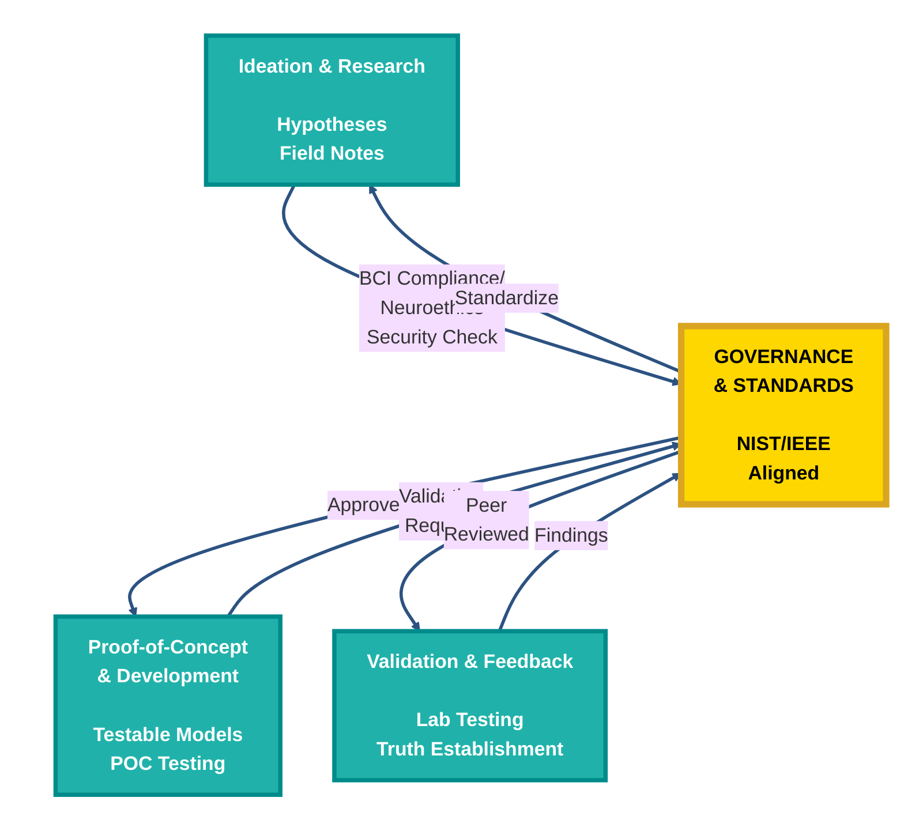

# CIV Lifecycle Diagram - Creation Instructions

## Option 1: Use Mermaid Live Editor (Easiest)

1. Go to https://mermaid.live/
2. Paste the code below into the editor
3. Click "Export" → PNG or SVG
4. Save to `docs/images/civ-lifecycle.png`

### Mermaid Code:



---

## Option 2: Use Draw.io / Diagrams.net (Free, No Account Needed)

1. Go to https://app.diagrams.net/
2. Choose "Blank Diagram"
3. Create the following structure:

### Central Circle (Gold):
- **Shape:** Circle
- **Fill:** #FFD700 (Gold)
- **Border:** #DAA520 (Dark Gold), 6px thick
- **Text:**
  ```
  GOVERNANCE
  & STANDARDS

  NIST/IEEE
  Aligned
  ```
- **Size:** Large (center of diagram)

### Three Outer Circles (Teal):
Position them at 120° intervals around the center (like a clock at 2, 6, and 10)

**Circle 1 (Top Right - 2 o'clock):**
- **Fill:** #20b2aa (Teal)
- **Border:** #008B8B (Dark Teal), 4px
- **Text:**
  ```
  Ideation & Research

  Hypotheses
  Field Notes
  ```

**Circle 2 (Bottom - 6 o'clock):**
- **Fill:** #20b2aa (Teal)
- **Border:** #008B8B (Dark Teal), 4px
- **Text:**
  ```
  Proof-of-Concept
  & Development

  Testable Models
  POC Testing
  ```

**Circle 3 (Top Left - 10 o'clock):**
- **Fill:** #20b2aa (Teal)
- **Border:** #008B8B (Dark Teal), 4px
- **Text:**
  ```
  Validation & Feedback

  Lab Testing
  Truth Establishment
  ```

### Arrows (All through center):
- **Color:** #2C5282 (Dark Blue)
- **Width:** 3px
- **Labels:**
  - Circle 1 → Center: "BCI Compliance/Neuroethics Security Check"
  - Center → Circle 2: "Approved"
  - Circle 2 → Center: "Validation Request"
  - Center → Circle 3: "Peer Reviewed"
  - Circle 3 → Center: "Findings"
  - Center → Circle 1: "Standardize"

---

## Option 3: Use Canva (Free Account Required)

1. Go to https://www.canva.com/
2. Create new design → Custom size (1600x1600px)
3. Add circles and text using the structure above
4. Export as PNG

---

## Color Reference

| Element | Fill Color | Border Color | Text Color |
|---------|-----------|--------------|------------|
| **Governance (Center)** | #FFD700 (Gold) | #DAA520 (Dark Gold) | #000000 (Black) |
| **Stage Circles** | #20b2aa (Teal) | #008B8B (Dark Teal) | #FFFFFF (White) |
| **Arrows** | - | #2C5282 (Dark Blue) | #2C5282 (Dark Blue) |

---

## Visual Layout

```
         (Ideation & Research)
                   ↓
              [GOVERNANCE]  ← (Validation & Feedback)
                   ↓
         (Proof-of-Concept)
```

All arrows pass through the central GOVERNANCE circle, showing continuous oversight.

---

## Recommended: Mermaid Live Editor

The easiest option is Mermaid Live - just paste the code, export PNG, and save to `docs/images/civ-lifecycle.png`.

**Direct link:** https://mermaid.live/
