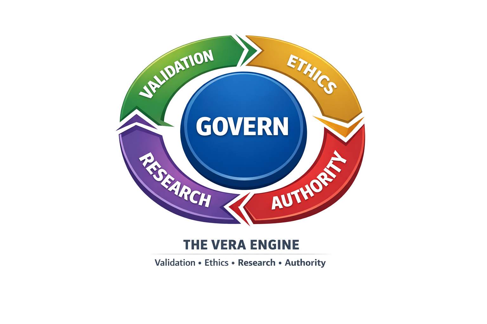

# The VERA Engine: Validation • Ethics • Research • Authority

To arrive at this final model, we stripped away the "move fast and break things" mentality of traditional software and replaced it with a scientific and legal "flywheel."

Qinnovate determined it is most logical to limit its scope to validation, ethics, research, and authority — while deployment and implementation are best handled by separate entities to prevent institutional bias.

---

## The Path of Derivation

### The Problem
Standard CI/CD (Continuous Integration/Deployment) is too risky for high-stakes technology (BCI, AI, Security) because it treats "deployment" as the goal rather than "validation."

### The Pivot
We shifted the focus from **Time-to-Market** to **Time-to-Autonomy.** We realized that stakeholder autonomy requires validated, authoritative knowledge — established only when a hypothesis is proven in a lab and then vetted by an external body.

### The Integration
We fused the **Scientific Method** (Left Loop) with the **Public Policy Cycle** (Right Loop). This ensures that technical discovery automatically triggers legal and ethical updates.

### The Final Result
The **VERA Engine** is a perpetual loop that ensures every technological advancement is lab-proven and legally codified before it is released.

---

## The VERA Engine

The VERA Engine is Qinnovate's core process for standards development — a perpetual loop that ensures every technological advancement is lab-proven and legally codified before it is released as authorized knowledge.

**Validation • Ethics • Research • Authority**

### The Four Pillars

#### Validation

**Lab-Proven POCs:** All hypothesis testing occurs in controlled, sandboxed laboratory environments.

**Controlled POC Development:**
- **Security POCs:** Testing theoretical vulnerabilities exclusively in controlled settings
- **Feature POCs:** Prototyping new BCI capabilities with ethical oversight
- **Capability POCs:** Validating detection methods and security mechanisms

**Strict Requirement:** All POC testing occurs in isolated environments to prevent real-world harm while gathering empirical data.

#### Ethics

**Neuroethics Embedded Throughout:** Every stage of the VERA cycle includes ethics vetting.

**Built-In Policy Process:**
- Research proposals must align with neuroethics principles from the start (UNESCO, GDPR, FDA)
- Lab testing follows strict ethical research constraints
- Peer review includes ethics vetting alongside technical review
- Standards publication requires full compliance documentation

**Data Vetting:** Lab results are measured against Q-Metrics (Quality/Quantitative benchmarks).

#### Research

**Scientific Methodology:** Hypothesis formulation based on current gaps in standards.

**NIST/IEEE Alignment:** The Governance Core ensures research data is formatted to update global standards.

**Peer-Reviewed Findings:** All research undergoes rigorous academic and industry validation before standardization.

#### Authority

**Independent External Council:** A council of legal, ethical, and technical experts audits all findings.

**Policy Implementation:** The Council formalizes validated research into official Standards or Policies.

**Authorized Dissemination:** Verified knowledge is deployed — not as code, but as **Authorized Knowledge** and updated protocols for the community to adopt.

**Perpetual Change:** This cycle ensures that every POC — whether discovering a flaw or introducing a capability — becomes a vital data point that forces the engine to perpetuate change, leading to stronger, more comprehensive standards.

---

## Why Four Pillars?

Qinnovate deliberately excludes product deployment and commercial implementation from its process. These functions are handled by separate entities (such as Mindloft) to prevent bias in the standards development process.

**Separation of Concerns:**
- **Qinnovate:** Standards body (validation, ethics, research, authority)
- **Product Companies:** Implementation entities (deployment, commercialization, integration)

This mirrors how organizations like NIST and IEEE maintain independence from product vendors while setting the standards those vendors implement.

---

## The Evolution: From CIV to VERA

**Note:** The original Continuous Iteration & Validation (CIV) framework has been repurposed for Mindloft's future use and will be expanded for their research labs. CIV's emphasis on continuous deployment made it better suited for product development cycles rather than standards body governance.

VERA represents Qinnovate's maturation from a development-focused lifecycle to a standards-focused authority cycle.

---

## Related Resources

- [Research Lifecycle Diagram](../README.md#-research-lifecycle-continuous-innovation-cycle)
- [Governance Standards](../governance/)
- [QIF Framework](../qif-framework/)
- [ONI Framework](../oni-framework/)

---

*Last Updated: 2026-02-06*
