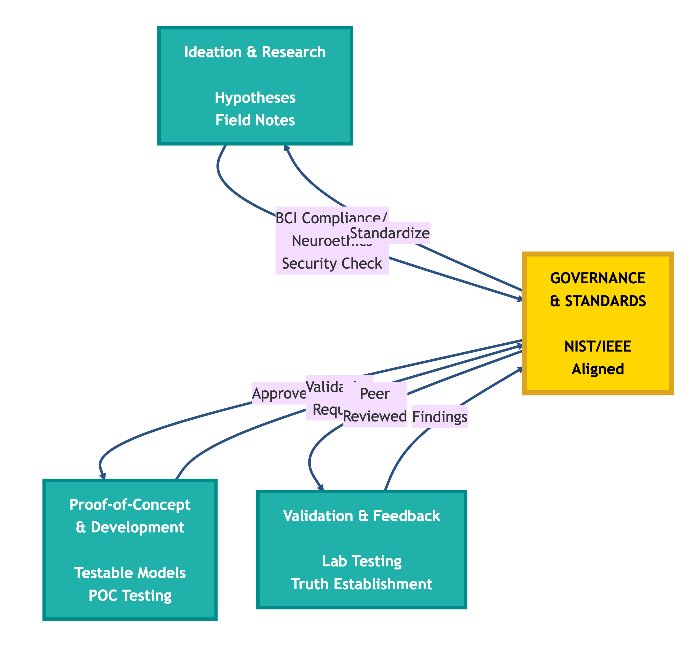

# The Qinnovate Engine: Continuous Iteration & Validation (CIV)

Our engine that perpetuates change is the **Continuous Iteration & Validation (CIV) lifecycle**, which represents our approach to advanced technology development. CIV is designed to bridge the gap between abstract academic R&D cycles and the rapid, reliable deployment principles of modern CI/CD (Continuous Integration/Continuous Delivery).

We recognized that standard CI/CD pipelines prioritize speed of software release, which doesn't fully account for the deep research, ethical vetting, and rigorous scientific validation required for high-stakes technology. The CIV framework solves this by embedding governance and extensive validation as the core, central truth of an infinite, iterative loop.

## How R&D Meets CI/CD

The framework integrates key elements from both methodologies, orbiting around a central point of authority: **Governance & Standards**.

- **From R&D:** We instill phases for **Ideation & Research** (the scientific method), which are immediately vetted by the central governance body.
- **From CI/CD:** We adopt the "continuous" philosophy for **Iteration & Validation**. The process demands automated feedback loops, rapid **Proof-of-Concept & Development**, all centrally aligned with the governing standards (like NIST/IEEE).

## The Core Distinction: Powering the Qinnovate Engine

While traditional DevOps focuses on improving "time-to-market," the **Qinnovate Engine** focuses on improving **"time-to-truth."** This engine is not merely a process; it's a perpetual motion machine that generates verified knowledge, with **Governance & Standards** at its very core.

During the **Validation & Feedback** stage, the ecosystem acts as the engine's stress test, identifying potential weaknesses in the underlying scientific models. This finding immediately fuels the **Ideation & Research** phase of Qinnovate. Qinnovate then acts as the governing flywheel, validating the corrections, amending the official standard, and formally disseminating this vital information to the broader community, ensuring every part of the system is running on the most current, verified protocols.

## Built-In Policy Process

The CIV lifecycle was designed with **continuous governance enforcement** throughout every stage — mirroring how NIST embeds policy compliance at all phases of technology development. Unlike traditional development processes where governance is a checkpoint at the end, CIV ensures:

- **Governance at Ideation:** Research proposals must align with neuroethics principles from the start
- **Governance at POC:** Lab testing follows strict ethical research constraints
- **Governance at Validation:** Peer review includes ethics vetting alongside technical review
- **Governance at Dissemination:** Standards publication requires full compliance documentation
- **Governance at Implementation:** Products must demonstrate continued adherence to published standards

This ensures that every output of the CIV cycle — whether it's a POC finding, a published standard, or a deployed product — has been vetted for compliance, ethics, and safety at every step. Governance isn't an afterthought; it's the foundation.

## The CIV Lifecycle Stages

Every phase in the loop is anchored by central **Governance & Standards (NIST/IEEE Aligned)**:

1. **Ideation & Research** — Formulating hypotheses and gathering initial field notes
2. **Proof-of-Concept & Development** — Building testable models and draft frameworks
3. **Validation & Feedback** — Hands-on lab testing using Q Metrics and establishing the current "Truth"

## The Research Validation Process: From POC to Peer Review

The function of the Qinnovate Engine maps directly to how researchers develop Proof-of-Concept (POC) implementations. A POC is an empirical demonstration that validates a hypothesis — whether that's testing a security vulnerability or prototyping a new BCI capability.

**Mindloft's Role (The Experimenter):** Mindloft develops POCs during the **Proof-of-Concept & Development** phase. This includes:
- **Security POCs:** Testing theoretical vulnerabilities in controlled laboratory environments
- **Feature POCs:** Prototyping new BCI capabilities or framework enhancements
- **Capability POCs:** Validating new detection methods or security mechanisms

**All POC development and testing occurs exclusively in controlled laboratory environments under strict ethical research constraints.** For security POCs, exploits are never deployed against production systems or real-world targets outside the lab. For feature POCs, new capabilities undergo rigorous validation before standardization.

**Qinnovate's Role (The Governing Body/Peer Review):** When Mindloft presents validated POC data, Qinnovate acts as the central **Governance & Standards** body. It conducts peer review of the findings, validates the research, and either:
- Amends existing standards (if a vulnerability was found)
- Incorporates new capabilities (if a feature was validated)
- Initiates formal standardization (if novel research was proven)

**Perpetual Change:** This cycle ensures that every POC — whether discovering a flaw or introducing a capability — becomes a vital data point that forces the engine to perpetuate change, leading to stronger, more comprehensive standards.

---

## Related Resources

- [Research Lifecycle Diagram](../README.md#-research-lifecycle-continuous-innovation-cycle)
- [Governance Standards](../governance/)
- [QIF Framework](../qif-framework/)
- [ONI Framework](../oni-framework/)

---

*Last Updated: 2026-02-05*
