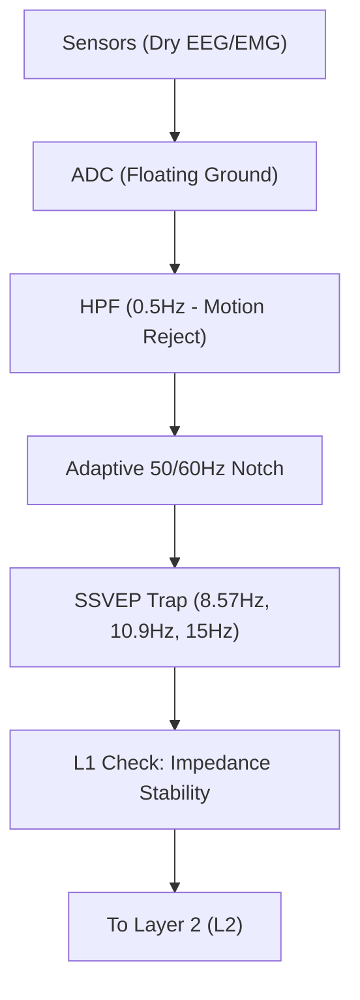

# Engineering Blueprint: Neurowall L1/L2

This document details the signal processing chain for **Neurowall** on non-intrusive wearables.

## 1. Signal Acquisition Pipeline (L1)



### L1 Specification: The "SSVEP Trap"
Adversarial signal injection often uses square waves to override internal coherence.
- **Logic**: If spectral power at any SSVEP target frequency ($f_{target}$) exceeds the local baseline by $>3\sigma$ for $>200ms$ AND is not accompanied by a user-authorized visual stimulus, the frame is flagged as **INJECTED**.

## 2. Intent Privacy Engine (L2)

### The MFCC Guardrail (Subvocal EMG)
Targeting AlterEgo-style jawline arrays.
1.  **Framing**: 25ms windows with 10ms overlap.
2.  **Feature Extraction**: 13 Mel-frequency cepstral coefficients.
3.  **Privacy Masking (DP)**:
    - $X^{masked} = X + \text{Laplace}(0, \frac{\Delta f}{\epsilon})$
    - Where $\Delta f$ is the sensitivity of the intent decoder.

### The "Anonymizer" Differential Privacy Module (Conceptual C++)
```cpp
// Pseudocode for Local Differential Privacy on Neural Wearables
float laplace_noise(float scale) {
    float u = (float)rand() / RAND_MAX - 0.5;
    return -scale * (u > 0 ? 1 : -1) * log(1 - 2 * abs(u));
}

void apply_neural_firewall_dp(float* raw_signal, int length, float epsilon) {
    float sensitivity = 1.0; // Normalized signal sensitivity
    float scale = sensitivity / epsilon;
    for (int i = 0; i < length; i++) {
        raw_signal[i] += laplace_noise(scale);
    }
}
```

## 3. L1/L2 Monitoring & Transport (NSP/TAL)

### NSP Frame Encapsulation
All telemetry is wrapped in **NSP v0.5 Frames**:
- **Metadata**: Band ID (N1-N7), Sequence #, QI Score.
- **Payload**: **Delta + LZ4** compressed neural data.
- **Security**: AES-256-GCM-SIV Auth Tag + SHA-256 Merkle Link.

### Runemate Resource Constraints (Chip Level)
- **CPU**: < 5% overhead (optimized via Scribe's recursive descent dispatch).
- **SRAM**: < 64KB for streaming buffers and context.
- **Flash (ROM)**: 200KB for Scribe executable + 32KB for NIST Policy matrices.

### Delta + LZ4 Neural Compression (67-90% Reduction)
To fit 250Hz - 1kHz multi-channel telemetry into BLE/NSP packets:
1.  **Delta Encoding**: Compute $D_n = S_n - S_{n-1}$. Since neural signals are continuous, $D_n$ is typically small, concentrating the probability distribution around zero (Entropy reduction).
2.  **LZ4 (Staged)**: Apply LZ4 compression to blocks of 100 deltas. 
    - *Physical constraint*: The LZ4 window size is capped at 4KB to fit in SRAM.
    - *Result*: Handshake-heavy NSP frames are offset by the massive payload reduction.

### Amortized PQ Signatures (Merkle Trees)
Post-quantum signatures (ML-DSA-65) are ~3.3KB, too large for every individual telemetry packet.
- **Strategy**: Group 100 frames into a **Merkle Tree**.
- **Execution**: Only the **Merkle Root** is signed via ML-DSA and SPHINCS+. 
- **Efficiency**: Per-frame overhead drops from 3,309 bytes to ~144 bytes, preserving the 40mW thermal budget of smart-glass chips.

## 4. Policy-to-NISS Mapping (Wearable Tier)
The firewall enforces NISS triggers directly on-chip:

| Trigger | Condition | Firewall Action |
| :--- | :--- | :--- |
| **LAT (Latent Influence)** | Score > 0.6 | Activate **Differential Privacy $(\epsilon=0.1)$**; obfuscate semantic intent. |
| **NP (Neuroplasticity)** | $T$ (True) | Hard-cap haptic stimulator current to **< 5mA**. |
| **BIO (Biological Impact)** | Critical | Enable **Air-Gap Mode**: Disable all inbound data streams; local-only processing. |
