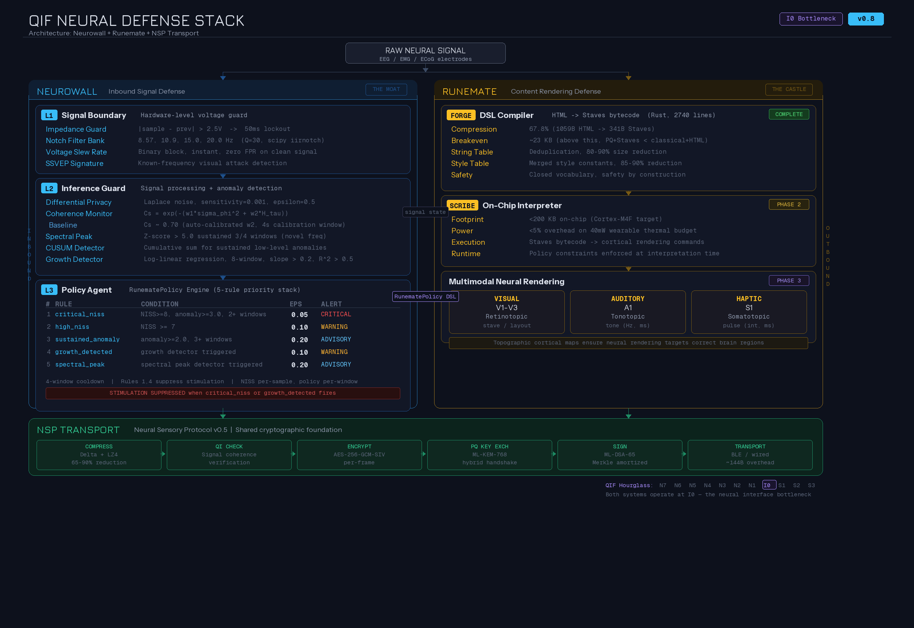

# Neurowall

> **QIF Module — Neurowall**
> **Status:** Phase 1 Architecture (Design-Complete)
> **Date:** 2026-02-21
> **Authors:** Kevin Qi, Antigravity (Gemini)
> **Parent Framework:** [QIF v4.0 Hourglass](../qif-framework/README.md) / [NSP v0.5](../qif-framework/NSP-PROTOCOL-SPEC.md) / [Runemate](../qif-framework/RUNEMATE.md)

---

## What is this?

**Neurowall** is a hardware-level security architecture for non-intrusive BCI wearables — specifically smart glasses (temporal dry EEG/EOG) and subvocal collars (jawline EMG, e.g. MIT AlterEgo).

It provides three concentric defense layers:
1. **Signal Boundary (L1)** — Prevents hardware-level signal injection and SSVEP-based adversarial attacks.
2. **Inference Guard (L2)** — Prevents neural fingerprinting and intent exfiltration via on-device Differential Privacy.
3. **Policy Agent (L3)** — RunematePolicy engine: a prioritized rule-stack that evaluates NISS scores, anomaly levels, and detector flags to dynamically adjust DP epsilon, suppress stimulation, and escalate alerts.

## Documents

| Document | Description |
| :--- | :--- |
| [ARCHITECTURE.md](./ARCHITECTURE.md) | High-level system design, threat model, and 3-layer defense strategy. |
| [ENGINEERING.md](./ENGINEERING.md) | Signal chain schematics, compression spec, Merkle amortization, and Rust pseudocode. |
| [NECKBAND_BLUEPRINT.md](./NECKBAND_BLUEPRINT.md) | Behind-the-neck wearable form factor: ground electrode + security processor + OpenBCI integration. |
| [MVP_PROTOTYPE.md](./MVP_PROTOTYPE.md) | Phase 0/1 prototype plan, BOM, and critical gaps from Gemini review. |
| [TESTING.md](./TESTING.md) | Test strategy and validation plan. |
| [NEUROWALL-DERIVATION-LOG.md](./NEUROWALL-DERIVATION-LOG.md) | Engineering decisions, coherence monitor design, and attack simulation results. |

## Simulation & Testing

| File | Description |
| :--- | :--- |
| [sim.py](./sim.py) | Full 3-layer pipeline simulation (v0.8). Multi-band EEG generator, auto-calibrating coherence weights, adaptive spectral peak detection, CUSUM detector, exponential growth detector, adaptive thresholding (LOO, opt-in), L1 notch filters + impedance guard, L2 differential privacy, L3 RunematePolicy engine (5-rule priority stack with cooldown and sustained window tracking), and NSP transport (delta + LZ4 + AES-256-GCM). No hardware required. |
| [test_nic_chains.py](./test_nic_chains.py) | NIC (Neural Impact Chain) attack simulation test suite. Runs 15 TARA-mapped attack scenarios (10 standard + 5 adversarial-aware) against the full pipeline. Supports single-run, duration sweep, multi-run statistical analysis, and ROC analysis with FPR-adjusted scoring. |
| [test_brainflow.py](./test_brainflow.py) | BrainFlow EEG validation. Tests the coherence monitor against BrainFlow's synthetic board (16-channel, 250Hz, independent EEG source). 5/5 attacks detected, 0% FPR, auto-calibration confirmed across 16 channels. Supports `--runs N`, `--channels`, `--verbose`. |
| [visualize.py](./visualize.py) | Visualization suite. Generates 6 chart types: detection summary, ROC curves, detection heatmap, Cs trajectories, spectral comparison, anomaly distributions. Outputs to `charts/`. |

### Running the Tests

```bash
# Full pipeline simulation (clean EEG, no attack)
python sim.py

# Inject SSVEP attack
python sim.py --attack --freq 15.0

# Run all 10 NIC chain attack scenarios (single run, 15s)
python test_nic_chains.py

# Run a single scenario with verbose per-window diagnostics
python test_nic_chains.py --scenario 5 --verbose

# Duration sweep: test detection at 10s, 20s, 30s, 60s
python test_nic_chains.py --sweep

# Statistical analysis: 50 runs per scenario with different seeds
python test_nic_chains.py --runs 50

# ROC analysis: sweep thresholds x durations to find optimal operating point
python test_nic_chains.py --roc --roc-runs 20

# BrainFlow validation (independent EEG source)
python test_brainflow.py

# BrainFlow multi-channel consistency test
python test_brainflow.py --channels

# BrainFlow statistical validation (20 runs)
python test_brainflow.py --runs 20

# Generate all visualization charts
python visualize.py

# Dependencies
pip install numpy scipy lz4 cryptography matplotlib brainflow
```

### Policy Engine (v0.8)

The L3 policy agent uses a `RunematePolicy` engine that evaluates a prioritized rule stack against live signal state. Each `PolicyRule` specifies conditions (NISS threshold, anomaly score, sustained window count, detector type) and actions (epsilon override, stimulation suppression, alert level).

**Default rule stack (5 rules, highest priority first):**

| # | Rule | Condition | Epsilon | Alert |
|---|------|-----------|---------|-------|
| 1 | `critical_niss` | NISS >= 8 AND anomaly >= 3.0 for 2+ windows | 0.05 | critical |
| 2 | `high_niss` | NISS >= 7 | 0.10 | warning |
| 3 | `sustained_anomaly` | anomaly >= 2.0 for 3+ windows | 0.20 | advisory |
| 4 | `growth_detected` | growth detector triggered | 0.10 | warning |
| 5 | `spectral_peak` | spectral peak detector triggered | 0.20 | advisory |

Rules 1 and 4 also suppress outbound stimulation. A 4-window cooldown prevents rapid oscillation between rules. Custom rule stacks can be provided via `RunematePolicy(rules=[...])` or loaded from config dicts (future: compiled from `.staves` policy files via Runemate Forge).

### Current Detection Results (v0.7)

**Single run (15s observation, 15 scenarios):**

| # | Attack | Detected By | Result |
|---|--------|------------|--------|
| 0 | Clean Signal (Control) | -- | BASELINE |
| 1 | SSVEP 15Hz | SSVEP | DETECTED |
| 2 | SSVEP 13Hz (novel freq) | Spectral Peak | DETECTED |
| 3 | Impedance Spike | L1 | DETECTED |
| 4 | Slow DC Drift | Spectral Peak | DETECTED |
| 5 | Neuronal Flooding (QIF-T0026) | L1 + SSVEP | DETECTED |
| 6 | Boiling Frog (QIF-T0066) | -- | **EVADED** |
| 7 | Envelope Modulation (QIF-T0014) | Monitor | DETECTED |
| 8 | Phase Replay (QIF-T0067) | -- | **EVADED** |
| 9 | Closed-Loop Cascade (QIF-T0023) | Monitor (growth + CUSUM) | DETECTED |
| 10 | Notch-Aware SSVEP 12Hz | Spectral Peak | DETECTED |
| 11 | Freq-Hopping SSVEP | Monitor | DETECTED |
| 12 | Threshold-Aware Ramp | -- | **EVADED** |
| 13 | CUSUM-Aware Intermittent | Monitor | DETECTED |
| 14 | Spectral Mimicry | Monitor | DETECTED |

**11/14 attacks detected at 15s, 3/14 evaded.** v0.7 adds 5 adversarial-aware attack scenarios that test detection against attackers who understand the defense architecture. 4/5 adversarial attacks are detected.

**Statistical analysis (50 runs, 15s, detection probability):**

| # | Attack | v0.5 | v0.6 | Change |
|---|--------|------|------|--------|
| 1 | SSVEP 15Hz | 100% | 100% | -- |
| 2 | SSVEP 13Hz (novel) | 0% | 100% | +100% |
| 3 | Impedance Spike | 98% | 100% | +2% |
| 4 | Slow DC Drift | 14% | 100% | +86% |
| 5 | Neuronal Flooding | 100% | 100% | -- |
| 7 | Envelope Modulation | 100% | 100% | -- |
| 9 | Closed-Loop Cascade | 32% | 98% | +66% |
| 6 | Boiling Frog | 20% | 32% | noise |
| 8 | Phase Replay | 0% | 10% | noise |

**ROC analysis optimal operating point: Threshold=12, Duration=20s, FPR=5%, TPR=100%.**

All 9 attacks detected with only 5% false positive rate at 20s observation. See `charts/roc_curves.png` for full ROC curves.

**Duration sweep:**

| Duration | Detected | Evaded | Notes |
|----------|----------|--------|-------|
| 10s | 6/9 | 3/9 | Cascade, boiling frog, phase replay evade |
| 15s | 8/9 | 1/9 | Only boiling frog evades |
| 20s | 9/9 | 0/9 | All attacks caught |
| 30s | 9/9 | 0/9 | All attacks caught |

See [NEUROWALL-DERIVATION-LOG.md Entry 009](./NEUROWALL-DERIVATION-LOG.md) for full analysis including spectral peak detection design, CUSUM implementation, ROC methodology, and visualization suite.

### BrainFlow Independent Validation

The end goal is a security guardrail baked directly into BCIs, not a separate node (see [Field Journal #018](../../blogs/2026-02-21-field-journal-018-building-the-moat-around-the-castle.md)). This simulation work validates that the approach is feasible before tackling hardware constraints (thermal budget, chip surface area, power). Validated against BrainFlow's synthetic board (16-channel, 250Hz) as an independent EEG source not designed with our detector. This confirms the coherence monitor generalizes beyond our own synthetic generator.

| Metric | Result |
|--------|--------|
| Detection rate (5 attacks, 20 runs) | **100%** |
| Clean FPR (20 runs) | **0%** |
| Cs consistency across 16 channels | spread 0.089 (PASS, < 0.15) |
| Auto-calibrating w2 | Targets Cs ~0.70 on both sources |

See [Entry 011](./NEUROWALL-DERIVATION-LOG.md#entry-011) for full BrainFlow validation methodology and multi-channel results.

### Visualization Charts

All charts are generated by `python visualize.py` and saved to `charts/`:

| Chart | Description |
|-------|-------------|
| `detection_summary.png` | Detection progress across v0.4/v0.5/v0.6 |
| `roc_curves.png` | FPR vs TPR curves by observation duration |
| `detection_heatmap.png` | Attack x duration detection matrix |
| `cs_trajectories.png` | Coherence score time series under each attack |
| `spectral_comparison.png` | Power spectra of clean vs attack signals |
| `anomaly_distributions.png` | Box plots of anomaly counts (30 runs) |

## Architecture



The QIF Neural Defense Stack positions Neurowall and Runemate as sibling defense components at the I0 (Neural Interface) bottleneck. Neurowall guards the inbound signal path (raw EEG/EMG from electrodes through filtering, anomaly detection, and policy enforcement). Runemate guards the outbound rendering path (compiling safe content into bytecode for on-chip execution). Both rest on the NSP cryptographic transport layer.

## Key Technical Properties

| Property | Value |
| :--- | :--- |
| **Transport Security** | NSP v0.5 (hybrid ML-KEM-768 + AES-256-GCM-SIV) |
| **Signature Amortization** | Merkle grouping (100 frames), per-frame overhead ~144 bytes |
| **Neural Compression** | Delta + LZ4 (4KB SRAM window), 65-90% size reduction |
| **On-Chip Footprint** | < 200KB (Runemate Scribe) |
| **Power Budget** | < 5% overhead on 40mW wearable thermal budget |
| **Differential Privacy** | Local-DP, Laplace noise (ε = 0.5) applied pre-transmission |

## Derivation History

**QIF-level derivations** (in [QIF-NEUROWALL-DERIVATION-LOG.md](../../qif-framework/QIF-NEUROWALL-DERIVATION-LOG.md)):

- **[Entry 68](../../qif-framework/QIF-NEUROWALL-DERIVATION-LOG.md#entry-68-guardrails-ssvep-thalamic-gate-raw):** Security Guardrails Synthesis + SSVEP Discovery + Thalamic Gate Model. Physics layer as boundary, not control.
- **[Entry 69](../../qif-framework/QIF-NEUROWALL-DERIVATION-LOG.md#entry-69-nist-iso-hardened-mapping):** NIST/ISO Hardened Compliance Mapping. Bridges neurorights to auditable technical evidence (NIST SP 800-53 / ISO 27001).
- **[Entry 70](../../qif-framework/QIF-NEUROWALL-DERIVATION-LOG.md#entry-70-wearable-neural-firewall):** Wearable Neural Firewall. Full architectural derivation: NSP v0.5 integration, Merkle amortization, Delta+LZ4 compression, Runemate Scribe execution.

**Neurowall-specific engineering log** (in [NEUROWALL-DERIVATION-LOG.md](./NEUROWALL-DERIVATION-LOG.md)):

- **Entry 001-004:** Coherence monitor design, Cs metric adaptation for single-channel EEG, software capacitor concept, QIF-T0026 flooding detection.
- **Entry 006:** NIC chain attack simulation test suite (10 scenarios, 3 bugs found/fixed).
- **Entry 007:** v0.4 trajectory tracker, DC drift detection failure analysis, FPR-adjusted detection methodology, and honest evasion boundary mapping (3/9 evade).
- **Entry 008:** v0.5 multi-band EEG generator, auto-calibrating w2, exponential growth detector, duration sweep results (all attacks caught at 30s), statistical analysis (50 runs per scenario).
- **Entry 009:** v0.6 adaptive spectral peak detection (novel SSVEP 0%→100%), CUSUM detector, growth detector hardening (cascade 32%→98%), ROC analysis (optimal: threshold=12, 20s, FPR=5%, TPR=100%), visualization suite (6 chart types).
- **Entry 010:** v0.7 adaptive thresholding (LOO, disabled by default), neurosim standalone tool (14 generators), 5 adversarial-aware attacks (4/5 detected).
- **Entry 011:** BrainFlow independent EEG validation. 16-channel synthetic board, 100% detection (5/5 attacks, 20 runs), 0% FPR, auto-calibration confirmed across all channels.

## Next Steps

- [x] ~~ROC curve analysis: sweep thresholds x durations to find optimal operating point for FPR < 5%~~ (Done: Entry 009, optimal at threshold=12, 20s)
- [x] ~~Improve growth detector reliability (32% cascade detection is too low)~~ (Done: Entry 009, now 98%)
- [x] ~~Validate against independent EEG source (BrainFlow synthetic board, 16ch)~~ (Done: Entry 011, 100% detection, 0% FPR)
- [ ] Validate against recorded EEG datasets (PhysioNet EEGBCI, MNE-Python)
- [ ] Implement Delta+LZ4 compression in Rust (target: `nsp` crate)
- [ ] Simulate adversarial SSVEP notch filter on mock EMG stream
- [ ] Connect firewall event logs to TAL (Temporal Aggregation Log)
- [ ] Validate Runemate Scribe footprint on Cortex-M4F reference platform
- [ ] Hardware reference electrode for boiling frog detection (Phase 1)
- [ ] Biological TLS challenge-response for phase replay defense (Phase 2)
